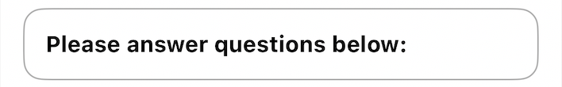
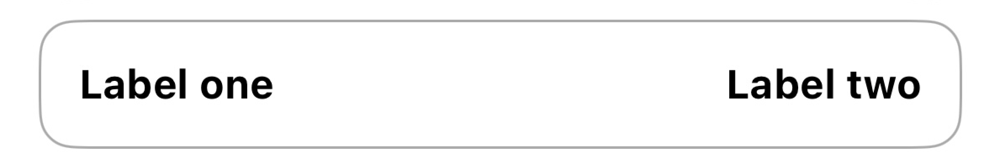
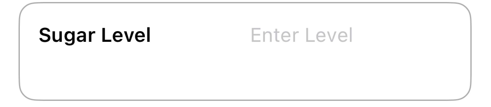
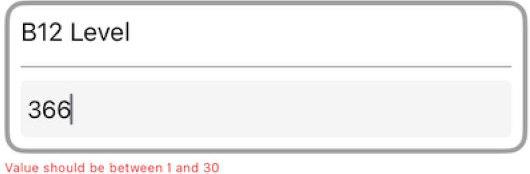

# Tile definitions

### Tile0

This tile represents a text.&#x20;

<table><thead><tr><th width="324">Properties</th><th>Preview</th></tr></thead><tbody><tr><td><ul><li>style: Regular or Bold</li><li>align: START, CENTER, END and JUSTIFY</li><li>borderColor: hex value</li><li>textColor: hex value</li></ul></td><td></td></tr></tbody></table>


```json
{
            "id": "Tile0",
            "subView": [
              {
                "title": {
                  "text": "00t1v0",
                  "style": "bold"
                }
              }
            ],
            "align":"START",
            "type": "CONTAINER",
            "uiAction": "",
            "order": 1
          }
```


### Tile0a

This tile represents two texts.

| Properties                                                                                                                                          | Preview                                  |
| --------------------------------------------------------------------------------------------------------------------------------------------------- | ---------------------------------------- |
| <ul><li>style: Regular or Bold</li><li>align: FIXED (left and right), JUSTIFY</li><li>borderColor: hex value</li><li>textColor: hex value</li></ul> |  |


```json
 {
            "id": "Tile0a",
            "subView": [
              {
                "title": {
                  "text": "00t1v36",
                  "style": "bold"
                },
                "subTitle": {
                  "text": "00t1v37",
                  "style": "bold"
                }
              }
            ],
            "align":"START",
            "type": "CONTAINER",
            "uiAction": "",
            "order": 1
          }
```


### Tile1

This tile represents a text input for a specific key.

| Properties                                                                                                                                                                                                                                                                                                                                                                    | Preview                                 |
| ----------------------------------------------------------------------------------------------------------------------------------------------------------------------------------------------------------------------------------------------------------------------------------------------------------------------------------------------------------------------------- | --------------------------------------- |
| <ul><li>min or max length validation</li><li>align: FIXED (left and right), JUSTIFY</li><li>keyboard: text or number</li><li>hint: placeholder for text input</li><li>key: <code>{*sugarLevel}</code>- The text input is set to key <code>sugarLevel</code>that will be used and sent through an event.</li><li>borderColor: hex value</li><li>textColor: hex value</li></ul> |  |


```json
{
            "id": "Tile1",
            "subView": [
              {
                "title": {
                  "text": "00t1v25"
                },
                "subTitle": {
                  "text": "{*sugarLevel}",
                  "hint": "00t1v26",
                  "keyboard": "text",
                  "min":"1",
                  "max":"30"
                }
              }
            ],
            "align":"START",
            "type": "CONTAINER",
            "uiAction": "",
            "order": 1
          }
```


### Tile1a

&#x20;This tile represents two rows with a text input for a specific key.

| Properties                                                                                                                                                               | Preview                                  |
| ------------------------------------------------------------------------------------------------------------------------------------------------------------------------ | ---------------------------------------- |
| <ul><li>Title text: First row.</li><li>Subtitle text: Second row (input field)</li><li>Text color: Hex value</li><li>Alignment: START, CENTER, END and JUSTIFY</li></ul> |  |


```json
{
                        "id": "Tile1a",
                        "subView": [
                            {
                                "title": {
                                    "text": "1tile1iitextiiixo",
                                    "titleTextColor": "#000080",
                                    "titleAlign": "JUSTIFY"
                                },
                                "subTitle": {
                                    "text": "{$ReferralCode}",
                                    "hint": "1tile1iihintii6km",
                                    "subTitleTextColor": "#000080",
                                    "subTitleAlign": "START",
                                    "keyboard": "text",
                                    "min": "1",
                                    "max": "1000",
                                    "validation": [
                                        {
                                            "name": "OPTIONAL",
                                            "error": "1tile1iierrorii6se"
                                        }
                                    ]
                                }
                            }
                        ],
                        "borderColor": "#87ceeb",
                        "type": "CONTAINER",
                        "uiAction": "",
                        "order": 4
                    }
```

