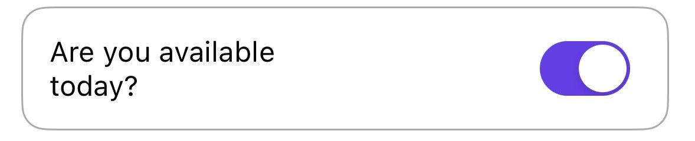
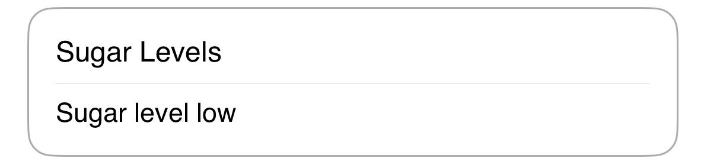

# Tile definitions

### Tile0

This tile represents a text.&#x20;

<table><thead><tr><th width="324">Configurations</th><th>Preview</th></tr></thead><tbody><tr><td><ul><li>style: Regular or Bold</li><li>align: START (left), CENTER, END (right) or JUSTIFY</li><li>border color: hex value</li><li>text color: hex value</li></ul></td><td><br></td></tr></tbody></table>

<pre class="language-json" data-title="Example:"><code class="lang-json"><strong>{
</strong>            "id": "Tile0",
            "subView": [
              {
                "title": {
                  "text": "00t1v0",
                  "style": "bold"
                }
              }
            ],
            "align":"START",
            "type": "CONTAINER",
            "uiAction": "",
            "order": 1
          }
</code></pre>

### Tile0a

This tile represents two texts.

| Configurations                                                                                                                                             | Preview                                  |
| ---------------------------------------------------------------------------------------------------------------------------------------------------------- | ---------------------------------------- |
| <ul><li>style: Regular or Bold</li><li>align: START (left), END (right) or JUSTIFY</li><li>border color: hex value</li><li>text color: hex value</li></ul> |  |


```json
 {
            "id": "Tile0a",
            "subView": [
              {
                "title": {
                  "text": "00t1v36",
                  "style": "bold"
                },
                "subTitle": {
                  "text": "00t1v37",
                  "style": "bold"
                }
              }
            ],
            "align":"START",
            "type": "CONTAINER",
            "uiAction": "",
            "order": 1
          }
```


### Tile1

This tile represents a text input for a specific key.

<table><thead><tr><th width="370">Configurations</th><th>Preview</th></tr></thead><tbody><tr><td><ul><li>min and max length</li><li>align: START (left), END (right) or JUSTIFY</li><li>keyboard: text or number</li><li>hint: placeholder for text input</li><li>key: <code>{*sugarLevel}</code>- The text input is set to key <code>sugarlevel</code> that will be used and sent through an event.</li><li>border color: hex value</li><li>text color: hex value</li></ul></td><td></td></tr></tbody></table>


```json
{
            "id": "Tile1",
            "subView": [
              {
                "title": {
                  "text": "00t1v25"
                },
                "subTitle": {
                  "text": "{*sugarLevel}",
                  "hint": "00t1v26",
                  "keyboard": "text",
                  "min":"1",
                  "max":"30"
                }
              }
            ],
            "align":"START",
            "type": "CONTAINER",
            "uiAction": "",
            "order": 1
          }
```


### Tile1a

&#x20;This tile represents two rows with a text input for a specific key.

| Configurations                                                                                                                                                                                                                                                                                                                                                                                                 | Preview                                  |
| -------------------------------------------------------------------------------------------------------------------------------------------------------------------------------------------------------------------------------------------------------------------------------------------------------------------------------------------------------------------------------------------------------------- | ---------------------------------------- |
| <ul><li>Title text is displayed on the first row</li><li>Subtitle text is displayed on the second row as an input field</li><li>text color: hex value</li><li>border color: hex value</li><li>align: START, CENTER, END and JUSTIFY</li><li>hint: placeholder for text input</li><li>keyboard: text or number</li><li>min and max length</li><li>validation: optional or required, and error message</li></ul> |  |


```json
{
                        "id": "Tile1a",
                        "subView": [
                            {
                                "title": {
                                    "text": "1tile1iitextiiixo",
                                    "titleTextColor": "#000080",
                                    "titleAlign": "JUSTIFY"
                                },
                                "subTitle": {
                                    "text": "{$ReferralCode}",
                                    "hint": "1tile1iihintii6km",
                                    "subTitleTextColor": "#000080",
                                    "subTitleAlign": "START",
                                    "keyboard": "text",
                                    "min": "1",
                                    "max": "1000",
                                    "validation": [
                                        {
                                            "name": "OPTIONAL",
                                            "error": "1tile1iierrorii6se"
                                        }
                                    ]
                                }
                            }
                        ],
                        "borderColor": "#87ceeb",
                        "type": "CONTAINER",
                        "uiAction": "",
                        "order": 4
                    }
```


### Tile2

This tile represents a text input for a specific key with tooltip.

| Configurations                                                                                                                                                                                                                                                                                                                                                                                                                                 | Preview                                 |
| ---------------------------------------------------------------------------------------------------------------------------------------------------------------------------------------------------------------------------------------------------------------------------------------------------------------------------------------------------------------------------------------------------------------------------------------------- | --------------------------------------- |
| <ul><li>min and max length</li><li>align: START (fixed left)</li><li>keyboard: text or number</li><li>hint: placeholder for text input</li><li>key: <code>{*age}</code> - The text input is set to <code>age</code> that will be used and sent through an event.</li><li>tip: text shows when a user clicks the question mark icon</li><li>border color: hex value</li><li>text color: hex value</li><li>icon mage: height and width</li></ul> |  |

```json
{
            "id": "Tile2",
            "subView": [
              {
                "title": {
                  "text": "00t1v23"
                },
                "subTitle": {
                  "text": "{*age}",
                  "hint": "00t1v24",
                  "keyboard": "text",
                  "min":"1",
                  "max":"30",
                  "tip": "00t1v22"
                }
              }
            ],
            "align":"START",
            "type": "CONTAINER",
            "uiAction": "",
            "order": 1
          }
```

### Tile3

This tile represents a data selection for a specific key.

| Configurations                                                                                                                                                                                                                                                                                                                                                                                    | Preview                                 |
| ------------------------------------------------------------------------------------------------------------------------------------------------------------------------------------------------------------------------------------------------------------------------------------------------------------------------------------------------------------------------------------------------- | --------------------------------------- |
| <ul><li>title label (left)</li><li>min and max date values</li><li>align: START (fixed left)</li><li>hint: placeholder for date input</li><li>key: <code>{*dateSelected}</code> - The date input is set to key <code>dateSelected</code>that will be used and sent through an event.</li><li>border color: hex value</li><li>text color: hex value</li><li>icon image: height and width</li></ul> |  |

```json
{
            "id": "Tile3",
            "subView": [
              {
                "title": {
                  "text": "00t1v19"
                },
                "subTitle": {
                  "text": "{*dateSelected}",
                  "hint": "00t1v20",
                  "min" : "12/01/2022",
                  "max" : "14/01/2022"
                }
              }
            ],
            "align":"START",
            "type": "CONTAINER",
            "uiAction": "",
            "order": 1
          }
```

### Tile5

This tile represents a stepper for a specific key.

| Configurations                                                                                                                                                                                                                                                                                                                                                                | Preview                                 |
| ----------------------------------------------------------------------------------------------------------------------------------------------------------------------------------------------------------------------------------------------------------------------------------------------------------------------------------------------------------------------------- | --------------------------------------- |
| <ul><li>title label (left)</li><li>start: the start number of the stepper</li><li>end: the end number of the stepper</li><li>align: START (fixed left), JUSTIFY</li><li>key: <code>{status}</code> - The selected value is set to key <code>status</code>that will be used and sent through an event.</li><li>border color: hex value</li><li>text color: hex value</li></ul> |  |

```json
{
            "id":"Tile5",
            "subView":[
              {
                "title":{
                  "text":"00t1v18"
                },
                "subTitle":{
                  "text":"{status}",
                  "start": 0,
                  "end": 100,
                  "count":10
                }
              }
            ],
            "align":"START",
            "type":"CONTAINER",
            "uiAction":"",
            "order":1
          }
```

### Tile6

This tile represents option selectors as radio buttons in horizontal format.

| Configurations                                                                                                                                                                                                                                                                                                                            | Preview                                 |
| ----------------------------------------------------------------------------------------------------------------------------------------------------------------------------------------------------------------------------------------------------------------------------------------------------------------------------------------- | --------------------------------------- |
| <ul><li>title label (left)</li><li>align: START, JUSTIFY</li><li>options: key and list</li><li>key: <code>{answer}</code> - The selected option is set to key <code>answer</code> that will be used and sent through an event.</li><li>list: dynamic options list</li><li>border color: hex value</li><li>text color: hex value</li></ul> |  |

```json
{
            "id": "Tile6",
            "subView": [
              {
                "title": {
                  "text": "00t1v5"
                },
                "options": {
                  "key":{
                    "name":"{answer}"
                  },
                  "list":[
                    
                    {
                      "label": "00t1v11"
                    },
                    {
                      "label": "00t1v12"
                    },
                    {
                      "label": "00t1v13"
                    }
                  ]
                  
                }
                
              }
            ],
            "align":"START",
            "type": "CONTAINER",
            "uiAction": "",
            "order": 1
          }
```

### Tile6a

This tile represents options selectors as radio buttons in vertical format.

| Configurations                                                                                                                                                                                                                                                                                                                            | Preview                                                                     |
| ----------------------------------------------------------------------------------------------------------------------------------------------------------------------------------------------------------------------------------------------------------------------------------------------------------------------------------------- | --------------------------------------------------------------------------- |
| <ul><li>title label (left)</li><li>align: START, JUSTIFY</li><li>options: key and list</li><li>key: <code>{answer}</code> - The selected option is set to key <code>answer</code> that will be used and sent through an event.</li><li>list: dynamic options list</li><li>border color: hex value</li><li>text color: hex value</li></ul> |  |

```json
{
            "id": "Tile6",
            "subView": [
              {
                "title": {
                  "text": "00t1v5"
                },
                "options": {
                  "key":{
                    "name":"{answer5}"
                  },
                  "list":[
                    
                    {
                      "label": "00t1v11"
                    },
                    {
                      "label": "00t1v12"
                    },
                    {
                      "label": "00t1v13"
                    }
                  ]
                  
                }
                
              }
            ],
            "align":"START",
            "type": "CONTAINER",
            "uiAction": "",
            "order": 1
          }
```

### Tile7

This tile represents a multi-option selector as check boxes in horizontal format.

| Configurations                                                                                                                                                                                                                                                                                              | Preview                                 |
| ----------------------------------------------------------------------------------------------------------------------------------------------------------------------------------------------------------------------------------------------------------------------------------------------------------- | --------------------------------------- |
| <ul><li>title label (left)</li><li>options: key and list</li><li>key: <code>{answer}</code> - The selected option is set to key <code>answer</code> that will be used and sent through an event.</li><li>list: dynamic options list</li><li>border color: hex value</li><li>text color: hex value</li></ul> |  |

```json
{
            "id": "Tile7",
            "subView": [
              {
                "title": {
                  "text": "00t1v5"
                },
                "options": {
                  
                  "key":{
                    "name":"{answer}"
                  },
                  "list":[
                    
                    {
                      "label": "00t1v11"
                    },
                    {
                      "label": "00t1v12"
                    },
                    {
                      "label": "00t1v13"
                    }
                  ]
                  
                }
                
              }
            ],
            "align":"START",
            "type": "CONTAINER",
            "uiAction": "",
            "order": 1
          }
```

### Tile7a

This tile represents a multi-option selector as check boxes in vertical format.

| Configurations                                                                                                                                                                                                                                                           | Preview                                  |
| ------------------------------------------------------------------------------------------------------------------------------------------------------------------------------------------------------------------------------------------------------------------------ | ---------------------------------------- |
| <ul><li>title label (left)</li><li>options: key and list</li><li>key: <code>{answer}</code> - The selected option is set to key <code>answer</code> that will be used and sent through an event.</li><li>border color: hex value</li><li>text color: hex value</li></ul> |  |

```json
{
            "id": "Tile7a",
            "subView": [
              {
                "title": {
                  "text": "00t1v5"
                },
                "options": {
                  
                  "key":{
                    "name":"{answer}"
                  },
                  "list":[
                    
                    {
                      "label": "00t1v11"
                    },
                    {
                      "label": "00t1v12"
                    },
                    {
                      "label": "00t1v13"
                    }
                  ]
                  
                }
                
              }
            ],
            "align":"START",
            "type": "CONTAINER",
            "uiAction": "",
            "order": 1
          }
```

### Tile7b

This tile is the same as [Tile7a](tile-definitions.md#tile7a) with an extra option for subtitle.&#x20;

| Configurations                                                                                             | Preview                                  |
| ---------------------------------------------------------------------------------------------------------- | ---------------------------------------- |
| <p>For subtitle color handling:</p><ul><li>border color: hex value</li><li>text color: hex value</li></ul> |  |

```
{
            "id": "Tile7b",
            "subView": [
              {
                "title": {
                  "text": "00t1v5"
                },
                "options": {
                  
                  "key":{
                    "name":"{answer}"
                  },
                  "list":[
                    
                    {
                      "label": "00t1v11",
                      "subTitle":{
                        "text": "{00t1v11}",
                        "colorCode": "00FF00"
                    },
                    {
                      "label": "00t1v12"
                      "subTitle":{
                        "text": "{00t1v12}",
                        "colorCode": "00FF00"                
                    },
                    {
                      "label": "00t1v13"
                      "subTitle":{
                        "text": "{00t1v13}",
                        "colorCode": "00FF00"
                    }
                  ]
                  
                }
                
              }
            ],
            "align":"START",
            "type": "CONTAINER",
            "uiAction": "",
            "order": 1
          }
```

### Tile8

This tile represents a scrollable table grid.

| Configurations                                                                                                                                                                                                                                                                                                         | Preview                                                                    |
| ---------------------------------------------------------------------------------------------------------------------------------------------------------------------------------------------------------------------------------------------------------------------------------------------------------------------- | -------------------------------------------------------------------------- |
| <ul><li>title label (left)</li><li>options: key and list</li><li>key: <code>{answer}</code> - The selected option is set to key <code>answer</code> that will be used and sent through an event.</li><li>list: label and data</li><li>label: the header title</li><li>data: the list of data for each header</li></ul> |  |

```json
{
              "id": "Tile8",
              "subView": [
                {
                  "title": {
                    "text": "00t1v10"
                  },
                  "options": {
                    
                    "key":{
                      "name":"{answer}"
                    },
                    "list":[
                      {
                        "label": "00t1v11",
                        "data" : "00t1v14"
                      },
                      {
                        "label": "00t1v12",
                        "data" : "00t1v15"
                      },
                      {
                        "label": "00t1v13",
                        "data" : "00t1v16"
                      }
                    ]
                  }
                }
              ],
              "align":"START",
              "type": "CONTAINER",
              "uiAction": "",
              "order": 1
            }
```

### Tile9

This tile is the same as [Tile8](tile-definitions.md#tile8), with no title.

| Configurations                                             | Preview                                                                        |
| ---------------------------------------------------------- | ------------------------------------------------------------------------------ |
| See configurations for [Tile8](tile-definitions.md#tile8). |  |

```json
{
              "id": "Tile9",
              "subView": [
                {
                  "options": {
                    
                    "key":{
                      "name":"{answer}"
                    },
                    "list":[
                      {
                        "label": "00t1v11",
                        "data" : "00t1v14"
                      },
                      {
                        "label": "00t1v12",
                        "data" : "00t1v15"
                      },
                      {
                        "label": "00t1v13",
                        "data" : "00t1v16"
                      }
                    ]
                  }
                }
              ],
              "align":"START",
              "type": "CONTAINER",
              "uiAction": "",
              "order": 1
            }
```

### Tile10

This tile represents an option selector.

| Configurations                                                                                                                                                                                                                                                                    | Preview                                                                     |
| --------------------------------------------------------------------------------------------------------------------------------------------------------------------------------------------------------------------------------------------------------------------------------- | --------------------------------------------------------------------------- |
| <ul><li>title label (left)</li><li>options: key and list</li><li>key: {answer} - The selected option is set to key answer that will be used and sent through an event.</li><li>list: dynamic options list</li><li>border color: hex value</li><li>text color: hex value</li></ul> |  |

```json
{
            "id": "Tile10",
            "subView": [
              {
                "title": {
                  "text": "00t1v4"
                },
                "options": {
                  
                  "key":{
                    "name":"{answer}"
                  },
                  "list":[
                    
                    {
                      "label": "00t1v16"
                    },
                    {
                      "label": "00t1v17"
                    }
                  ]
                  
                }
                
              }
            ],
            "align":"START",
            "type": "CONTAINER",
            "uiAction": "",
            "order": 1
          }
```

### Tile10a

This tile represents a toggle option.

| Configurations                                                                                                                                                                                                                                                                                                              | Preview                                                                      |
| --------------------------------------------------------------------------------------------------------------------------------------------------------------------------------------------------------------------------------------------------------------------------------------------------------------------------- | ---------------------------------------------------------------------------- |
| <ul><li>title label (left)</li><li>options: key and list</li><li>key: <code>{answer}</code> - The selected option is set to key <code>answer</code> that will be used and sent through an event.</li><li>list: dynamic options to toggle on and off</li><li>border color: hex value</li><li>text color: hex value</li></ul> |  |

```json
{
            "id": "Tile10a",
            "subView": [
              {
                "title": {
                  "text": "00t1v4"
                },
                "options": {
                  
                  "key":{
                    "name":"{answer}"
                  },
                  "list":[
                    
                    {
                      "label": "00t1v16"
                    },
                    {
                      "label": "00t1v17"
                    }
                  ]
                  
                }
                
              }
            ],
            "align":"START",
            "type": "CONTAINER",
            "uiAction": "",
            "order": 1
          }
```

### Tile11

This tile represents a title and a text.

| Configurations                                                                                                                                              | Preview                                                                     |
| ----------------------------------------------------------------------------------------------------------------------------------------------------------- | --------------------------------------------------------------------------- |
| <ul><li>title label (left) on first row</li><li>subtitle label (left) on second row</li><li>border color: hex value</li><li>text color: hex value</li></ul> |  |

```json
{
            "id": "Tile11",
            "subView": [
              {
                "title": {
                  "text": "00t1v27"
                },"subTitle":{
                  "text":"00t1v28"
                }
              }
            ],
            "align":"START",
            "type": "CONTAINER",
            "uiAction": "",
            "order": 1
            
          }
```

### Tile11a

This tile is the same as [Tile11](tile-definitions.md#tile11) with scrollable subtitle text.

| Configurations                                                                                                                                                                                                             | Preview                                                                      |
| -------------------------------------------------------------------------------------------------------------------------------------------------------------------------------------------------------------------------- | ---------------------------------------------------------------------------- |
| <p>For subtitle view:</p><ul><li>heightMultiplier: "1" - This value is calculated according the screen ratio.</li><li>text includes JUSTIFY option</li><li>border color: hex value</li><li>text color: hex value</li></ul> |  |

```json
{
            "id": "Tile11",
            "subView": [
              {
                "title": {
                  "text": "00t1v27"
                },"subTitle":{
                  "text":"00t1v28",
                  "heightMultiplier":"1"
                }
              }
            ],
            "align":"START",
            "type": "CONTAINER",
            "uiAction": "",
            "order": 1
            
          }
```

### Tile12

This tile represents a dropdown list selector.

| Configurations                                                                                                                                                                                                                                                                                                                                                                                                                                                                                  | Preview                                                                     |
| ----------------------------------------------------------------------------------------------------------------------------------------------------------------------------------------------------------------------------------------------------------------------------------------------------------------------------------------------------------------------------------------------------------------------------------------------------------------------------------------------- | --------------------------------------------------------------------------- |
| <ul><li>title label (left)</li><li>subtitle: key, hint, and data</li><li>key: {*patient} - The selected option is set to key patient that will be used and sent through an event.</li><li>hint: placeholder for the selected option</li><li>data: an array of options loaded from cardData, for example: ["option 1", "option 2", "option 3"]</li><li>text includes JUSTIFY option</li><li>border color: hex value</li><li>text color: hex value</li><li>icon image: height and width</li></ul> |  |

```json
{
            "id": "Tile12",
            "subView": [
              {
                "title": {
                  "text": "00t1v29"
                },
                
                "subTitle": {
                  "text": "{*patient}",
                  "hint": "00t1v30",
                  "keyboard": "text",
                  "data" : "00t1v14"
                }
              }
            ],
            "align":"START",
            "type": "CONTAINER",
            "uiAction": "",
            "order": 1
          }
```

### Tile14

This tile represents an action clickable tile.

| Configurations                                                                                                                                                                                                                                         | Preview                                                                     |
| ------------------------------------------------------------------------------------------------------------------------------------------------------------------------------------------------------------------------------------------------------ | --------------------------------------------------------------------------- |
| <ul><li>title label</li><li>uiAction: "${action1}" - This value is correlated with an event handler.</li><li>text includes JUSTIFY option</li><li>border color: hex value</li><li>text color: hex value</li><li>icon image: height and width</li></ul> |  |

```json
 {
            "id":"Tile14",
            "subView":[
              {
                "title":{
                  "text":"00t1v21"
                }
                
              }
            ],
            "align":"START",
            "type":"CONTAINER",
            "uiAction":"${action1}",
            "order":1
          }
```

### Tile14a

This tile is the same as [Tile14](tile-definitions.md#tile14) with subtitle.

| Configurations                                                                                                                                                        | Preview                                                                      |
| --------------------------------------------------------------------------------------------------------------------------------------------------------------------- | ---------------------------------------------------------------------------- |
| <ul><li>style: bold</li><li>text includes JUSTIFY option</li><li>border color: hex value</li><li>text color: hex value</li><li>icon image: height and width</li></ul> |  |

```json
 {
            "id":"Tile14a",
            "subView":[
              {
                "title":{
                  "text":"00t1v21",
                  "style":"bold"
                },
                "subTitle":{
                  "text":"00t1v21",
                  "style":"bold"
                },
                "img":{
                  "text":"00t1v35"
              }
            ],
            "align":"START",
            "type":"CONTAINER",
            "uiAction":"${action1}",
            "order":1
          }
```

### Tile16

This tile represents an image that can be loaded locally or from a URL.

| Configurations                                                                                                                                                                                         | Preview                                                                     |
| ------------------------------------------------------------------------------------------------------------------------------------------------------------------------------------------------------ | --------------------------------------------------------------------------- |
| <ul><li>image: text, isURL, height and width</li><li>text: the source of the image (link or image name) loaded from the cardData</li><li>isURL: true or false</li><li>size: height and width</li></ul> |  |

```json
{
            "id":"Tile16",
            "subView":[
              {
                "img":{
                  "text":"00t1v35",
                  "isUrl":true
                }
              }
            ],
            "align":"START",
            "type":"CONTAINER",
            "uiAction":"",
            "order":1
          }
```

### Tile17

This tile represents selectable images.

| Configurations                                                                                                                                                                                                                                             | Preview                                                                         |
| ---------------------------------------------------------------------------------------------------------------------------------------------------------------------------------------------------------------------------------------------------------- | ------------------------------------------------------------------------------- |
| <ul><li>options: key and list</li><li>key: <code>{answer5}</code> - The selected option from the list is set to key <code>answer5</code> that will be used and sent through an event.</li><li>image: text and isURL</li><li>isURL: true or false</li></ul> |  |

```json
{
            "id":"Tile17",
            "subView":[
              {
                "options":{
                  "key":{
                    "name":"{answer5}"
                    },
                  "list":[
                    {
                    "label":"00t1v44",
                    "img":{
                      "text":"00t1v43",
                      "isURL":false
                    }
                  },
                    {
                    "label":"00t1v45",
                    "img":{
                      "text":"00t1v48",
                      "isURL":false
                    }
                  },
                    {
                    "label":"00t1v46",
                    "img":{
                      "text":"00t1v49",
                      "isURL":false
                    }
                  },
                    {
                    "label":"00t1v47",
                    "img":{
                      "text":"00t1v50",
                      "isURL":false
                    }
                  }
                ]
              }
                    
                "img":{
                  "text":"00t1v35",
                  "isUrl":true
                }
              }
            ],
            "order":1
            "type":"CONTAINER",
            "uiAction":""
          }
```

### Tile17a

This tile represents clickable images in a single row. Clicking the image navigates the user to a target location.

| Configurations                                                                                                                                                                                                          | Preview                                                                          |
| ----------------------------------------------------------------------------------------------------------------------------------------------------------------------------------------------------------------------- | -------------------------------------------------------------------------------- |
| <ul><li>subtitle text: reference to the title that displays below the image</li><li>align: START, CENTER, or END</li><li>text color: hex value</li><li>border color: hex value</li><li>uiAction: "action17a2"</li></ul> |  |


```json
{
                        "id": "Tile17a",
                        "subView": [
                            {
                                "options": {
                                    "list": [
                                        {
                                            "subTitle": {
                                                "text": "10tile17aiitextiizxq",
                                                "subtitleAlign": "CENTER",
                                                "colorCode": "#000080",
                                                "style": "REGULAR"
                                            },
                                            "img": {
                                                "text": "imageUrlo9w7y"
                                            },
                                            "uiAction": ""
                                        },
                                        {
                                            "subTitle": {
                                                "text": "9tile17aiitextii0ak",
                                                "subtitleAlign": "CENTER",
                                                "colorCode": "#000080",
                                                "style": "REGULAR"
                                            },
                                            "img": {
                                                "text": "imageUrlynopr"
                                            },
                                            "uiAction": "action17a2"
                                        },
                                        {
                                            "subTitle": {
                                                "text": "8tile17aiitextiimyk",
                                                "subtitleAlign": "END",
                                                "colorCode": "#000080",
                                                "style": "REGULAR"
                                            },
                                            "img": {
                                                "text": "imageUrlk6cem"
                                            },
                                            "uiAction": "action17a1"
                                        }
                                        
                                    ]
                                }
                            }
                        ],
                        "borderColor": "#ffffff",
                        "type": "CONTAINER",
                        "uiAction": "",
                        "order": 5
                    }
```



```json
"action17a2": {
            "action": [
                {
                    "name": "Function.Navigate",
                    "cardId":"cd-vwgot7h4rlhwnzjf24aqa37ezz4"
                    
                }
            ]
        }
```


### SmartTile1

This tile is an input field that is used to implement checks, such as "field format" and "field value".

| Configurations                                                                                                                                                                                                                                                                                                                                                                                  | Preview                                             |
| ----------------------------------------------------------------------------------------------------------------------------------------------------------------------------------------------------------------------------------------------------------------------------------------------------------------------------------------------------------------------------------------------- | --------------------------------------------------- |
| <ul><li>title text</li><li>subtitle text</li><li>text color: hex value</li><li>font size: number value</li><li>border color: hex value</li><li>align: START, CENTER, END or JUSTIFY</li><li>hint: placeholder for text input</li><li>min and max length</li><li>fieldFormat: Any supported field format, such as "email".</li><li>validation: optional or required, and error message</li></ul> |  |

```json
                    {
                        "id": "SmartTile1",
                        "subView": [
                            {
                                "title": {
                                    "text": "2tile1iitextii5gb",
                                    "titleTextColor": "#000080",
                                    "titleAlign": "START",
                                    "fontSize": 16
                                },
                                "subTitle": {
                                    "text": "{$email}",
                                    "hint": "2tile1iihintiid8l",
                                    "subTitleTextColor": "#000080",
                                    "subTitleAlign": "START",
                                    "tip": "2tile2iitipii3m6",
                                    "fieldFormat": "email",
                                    "validation": [
                                        {
                                            "name": "REQUIRED_FIELD",
                                            "error": "2tile1iierrorii0uj"
                                        }
                                    ]
                                }
                            }
                        ],
                        "borderColor": "#C5C3C8",
                        "type": "CONTAINER",
                        "uiAction": "",
                        "order": 2
                    }
```
