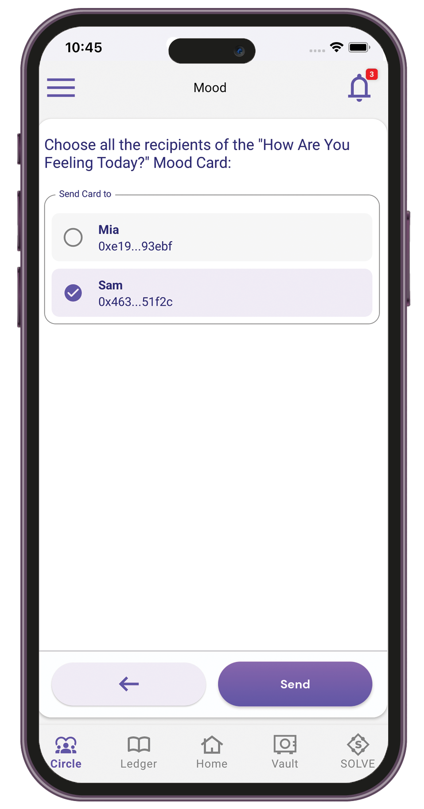

# Care.Circle

## Inviting participants

1. Sign in to your Care.Wallet app.
2. From the bottom navigation bar, tap **Circle**.

<figure><figcaption></figcaption></figure>

3. Tap **Invite Participants**. You can also navigate to **My Care.Circle** **>** **Invite Participants**.

<figure><figcaption></figcaption></figure>

4. Select **Enter invitation message**.

<figure><figcaption></figcaption></figure>

5. Type a text to include in the invitation message.

<figure><figcaption></figcaption></figure>

6. Tap **Save**.&#x20;

### Using a Wallet ID to invite participants

1. Sign in to your Care.Wallet app.
2. From the bottom navigation bar, tap **Circle**.
3. Tap **Invite Participants** **>** **Enter Wallet ID**.

<figure><figcaption></figcaption></figure>

4. Enter the Wallet ID of the user you want to invite.

<figure><figcaption></figcaption></figure>

5. Tap **Invite**.

### Sharing the invitation link

1. Sign in to your Care.Wallet app.
2. From the bottom navigation bar, tap **Circle**.
3. Tap **Invite Participants** **>** **Share link**.

<figure><figcaption></figcaption></figure>

4. Select how you want to send the invitation link. You can share it via email or a messaging app.

### Sending invite to contacts

1. Sign in to your Care.Wallet app.
2. From the bottom navigation bar, tap **Circle**.
3. Tap **Add from contacts**.

<figure><figcaption></figcaption></figure>

4. Select one or more contacts from your mobile phone. You can use the search to filter the contacts list.

<figure><figcaption></figcaption></figure>

5. Tap **Invite**.

## Sending "How Are You Feeling Today" cards

Send mood cards and survey questions to your Care.Circle members to check in on how they are feeling today.

1. Sign in to your Care.Wallet app.
2. From the bottom navigation bar, tap **Circle**.
3. Tap **How Are You Feeling Today**.

<figure><figcaption></figcaption></figure>

4.  Select either of the following:

    * Mood — Select at least two mood cards.

    

    <figure><figcaption></figcaption></figure>

     

    <figure><figcaption></figcaption></figure>

    

    * Survey — Select one or more questions.

    

    <figure><figcaption></figcaption></figure>

     

    <figure><figcaption></figcaption></figure>

    

5. Select a recipient from your Care.Circle.

<figure><figcaption></figcaption></figure>

6. Tap **Send**.

## Responding to received cards

1. Sign in to your Care.Wallet app.
2. From the bottom navigation bar, tap **Circle**.
3. Tap **How Are You Feeling Today > Received Cards**.

<figure><figcaption></figcaption></figure>

4. Select a mood card or answer the survey questions.

<figure><figcaption>
Mood
</figcaption></figure>

 

<figure><figcaption>
Survey
</figcaption></figure>

5. Send your response.
