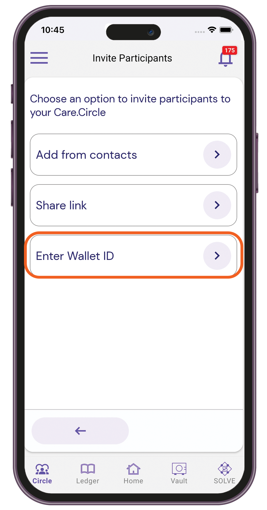

# Care.Circle

## Inviting participants

1. Sign in to your Care.Wallet app.
2. From the bottom navigation bar, tap **Circle**.

<figure><figcaption></figcaption></figure>

3. Navigate to **My Care.Circle** **>** **Invite Participants**.

<figure><figcaption></figcaption></figure>

### Add from contacts

1. From the Invite Participants card, tap **Add from contacts**.

<figure><figcaption></figcaption></figure>

2. Select one or more contacts from your mobile phone. You can use the search to filter the contacts list.

<figure><figcaption></figcaption></figure>

3. Send the invite.

### Share link

1. From the Invite Participants card, tap **Share link**.

<figure><figcaption></figcaption></figure>

2. Select how you want to send the invitation link. You can share it via email or a messaging app.
3. Send the invite.

### Enter Wallet ID

1. From the Invite Participants card, tap **Enter Wallet ID**.

<figure><figcaption></figcaption></figure>

2. Enter the Wallet ID of the user you want to invite.

<figure><figcaption></figcaption></figure>

3. Send the invite.

## Assigning a nickname

1. Sign in to your Care.Wallet app.
2. From the bottom navigation bar, tap **Circle**.
3. Navigate to **My Care.Circle** **>** **Invite Participants**.
4. Select the participant.
5. Tap **Assign nickname**.

<figure><figcaption></figcaption></figure>

6. Type the nickname, then save it.

## Removing participants

1. Sign in to your Care.Wallet app.
2. From the bottom navigation bar, tap **Circle**.
3. Navigate to **My Care.Circle** **>** **Invite Participants**.
4. Select the participant.
5. Tap **Remove from Care.Circle > Remove**.

<figure><figcaption></figcaption></figure>
