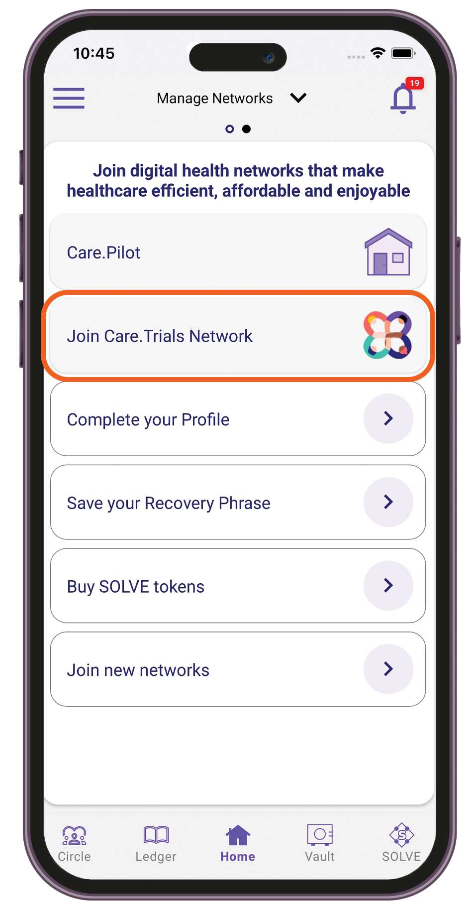
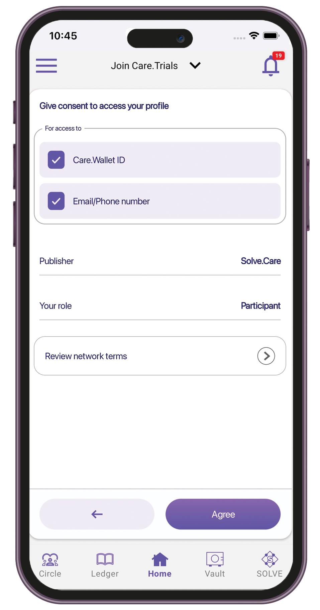

# Care.Trials

## Getting started

Participate in clinical trials to help discover new treatments and contribute to medical advancements. Join the Care.Trials network and search for clinical trials near you.&#x20;

## Types of roles in Care.Trials

* **Participants** — When you join the Care.Trials network as a participant, you will have access to available trials that match your profile and use swiping to like or skip matched trials.
* **Site Admin** — The site admin helps coordinate clinical trials in a specific site location. In the Care.Trials network, the site admin can view leads and interact with the participants to collect medical records and set appointments for screening.
* **Trial Admin** — The trial admin oversees the clinical trials in all sites. In the Care.Trials network, the trial admin can activate trials and set the budget for a trial site.
* **Nurse** — The nurse in the Care.Trials network can review the participant's ID and medical records.

## Joining the Care.Trials network

1. Sign in to the Care.Wallet app.
2. From the Manage Networks screen, tap **Join Care.Trials Network**.

<figure><figcaption></figcaption></figure>

3. Select your role, then tap **Next**.&#x20;

<figure><figcaption></figcaption></figure>

4. Grant access to your profile information.&#x20;

<figure><figcaption></figcaption></figure>

5. Review the terms and conditions, then tap **Agree**.
6. Wait up to 5 minutes to connect your Care.Wallet to the network.
