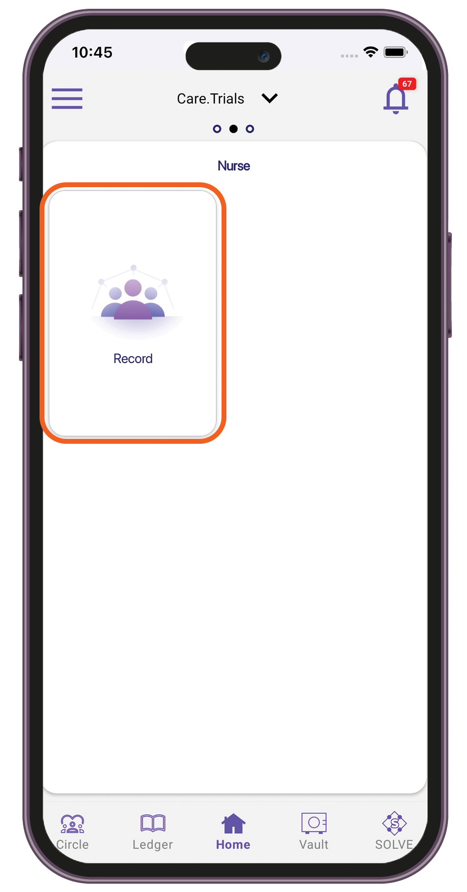
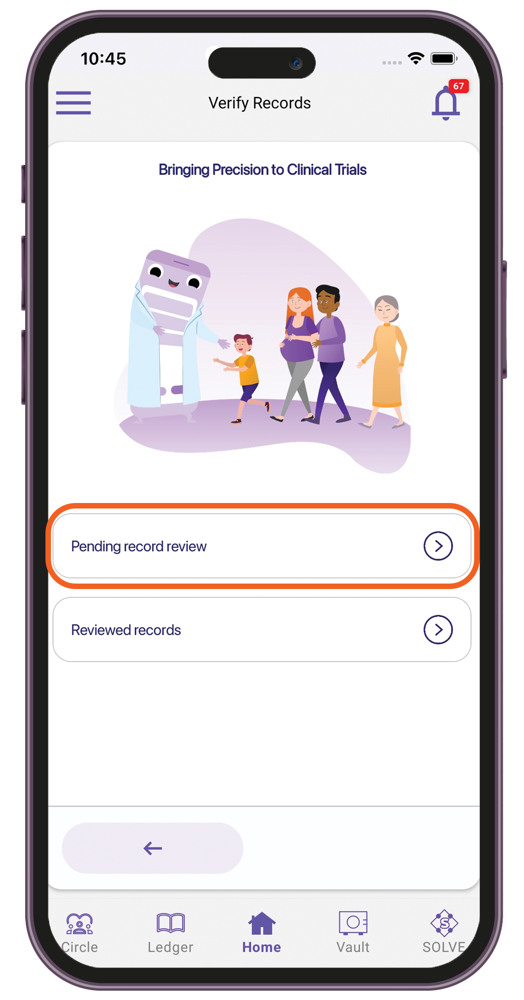
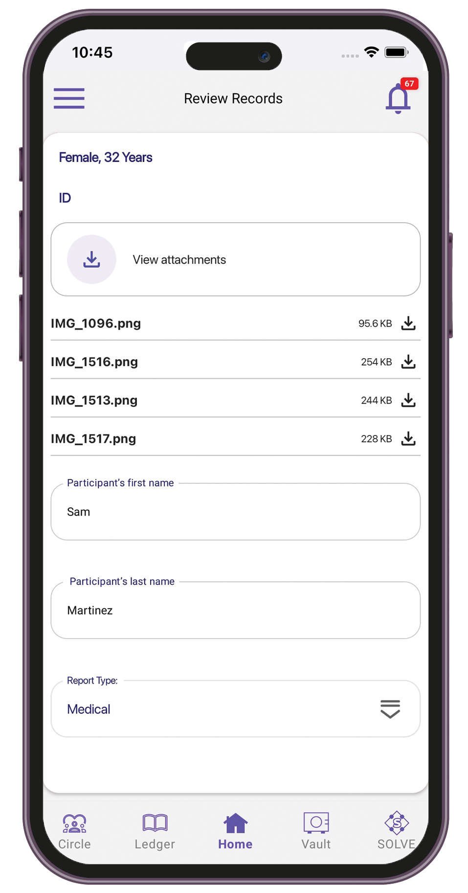
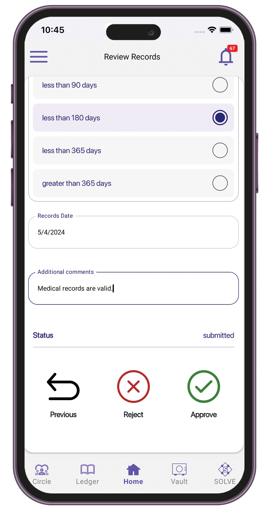
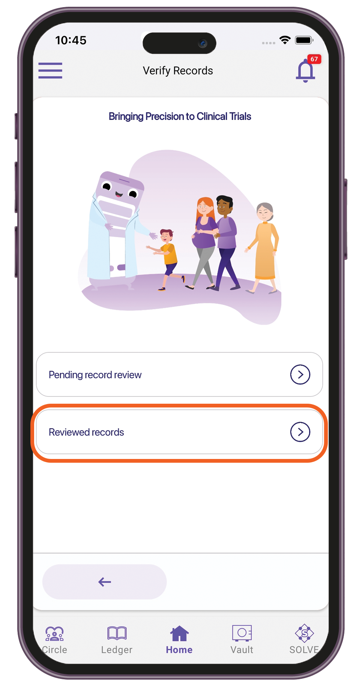
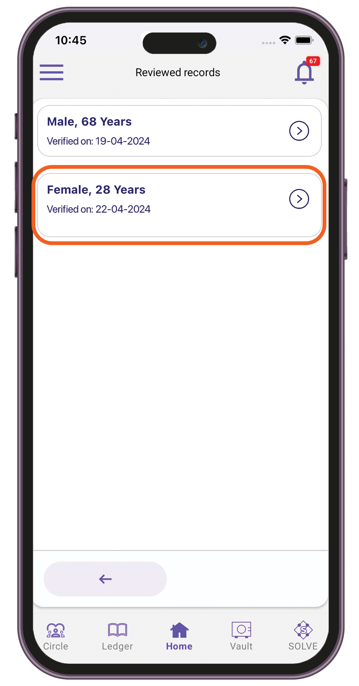
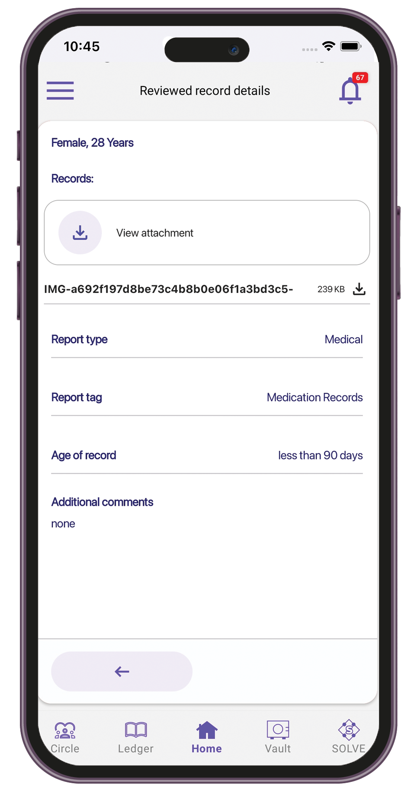

# Nurse

### Reviewing ID and medical records

1. Sign in to the Care.Wallet app.
2. From the Manage Networks screen, tap **Care.Trials**.
3. Tap **Record** **> Pending record review**.

<figure><figcaption></figcaption></figure>

 

<figure><figcaption></figcaption></figure>

4. Review the attached records, then fill in the participant details.

<figure><figcaption></figcaption></figure>

 

<figure><figcaption></figcaption></figure>

5. Approve or reject the records.

### Viewing reviewed records

1. Sign in to the Care.Wallet app.
2. From the Manage Networks screen, tap **Care.Trials**.
3. Tap **Record** **> Reviewed records**.

<figure><figcaption></figcaption></figure>

4. Select the record details you want to view.

<figure><figcaption></figcaption></figure>

 

<figure><figcaption></figcaption></figure>

