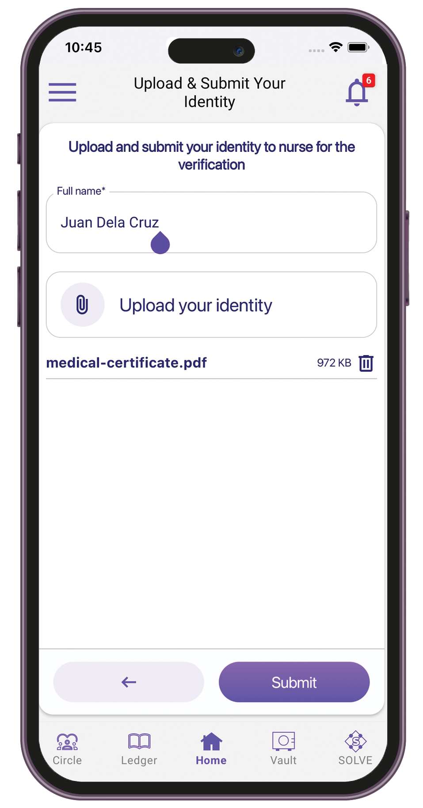
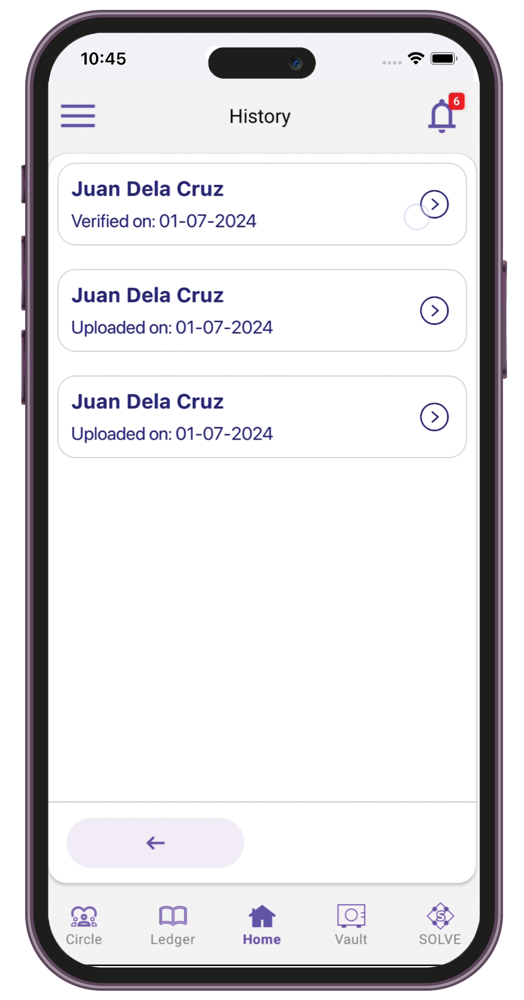
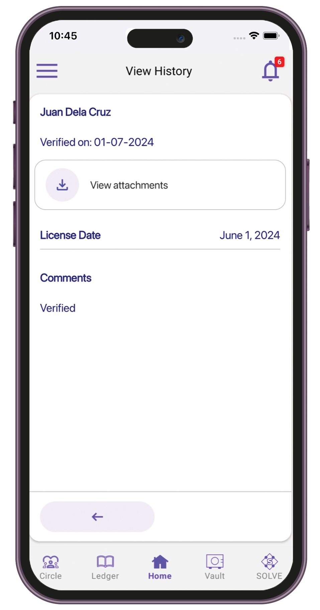

# Physician

### Verifying ID and medical license

1. Sign in to the Care.Wallet app.
2. From the Manage Networks screen, tap **Care.Trials**.
3. Tap **Verify your identity > Verify your identity**.

<figure><figcaption></figcaption></figure>

 

<figure><figcaption></figcaption></figure>

4. Enter your full name, then upload your ID or medical license.

<figure><figcaption></figcaption></figure>

5. Tap **Submit**.

### Viewing history of submitted IDs

1. Sign in to the Care.Wallet app.
2. From the Manage Networks screen, tap **Care.Trials**.
3. Tap **Verify your identity > ID history**.

<figure><figcaption></figcaption></figure>

4. Select the ID record details that you want to view.

<figure><figcaption></figcaption></figure>

 

<figure><figcaption></figcaption></figure>

