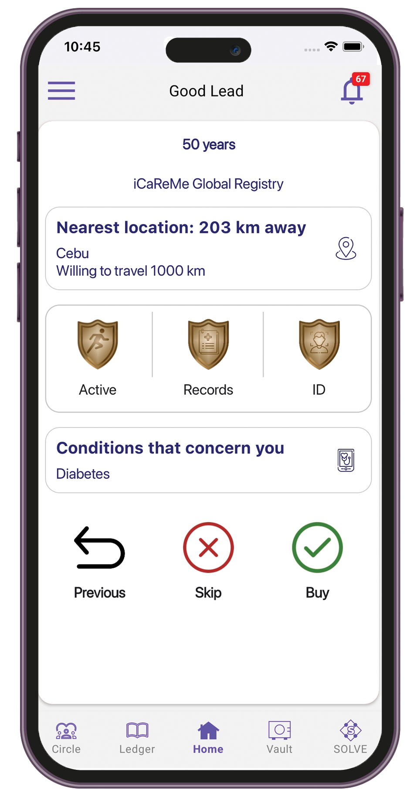

# Site Admin

### Activating a site

1. Sign in to the Care.Wallet app.
2. From the Manage Networks screen, tap **Care.Trials**.
3. Tap **Start Here**.

<figure><figcaption></figcaption></figure>

4. Tap **Activate Site**.
5. Tap **Step 1: Request site code.**

<figure><figcaption></figcaption></figure>

6. Enter the Trial ID and the email address where you want the activation code to be sent.

<figure><figcaption></figcaption></figure>

7. Tap **Request code**. Wait for the activation code to be sent to your email.
8. Tap **Step 2: Activate site role**.

<figure><figcaption></figcaption></figure>

9. Enter the activation code sent to your email.

<figure><figcaption></figcaption></figure>

10. Tap **Activate Site**.

### Buying leads


In Care.Trials, a lead is a potential participant in clinical trials. Make sure you have enough SOLVE balance to buy a lead. For instructions on how to buy SOLVE, see [Buying SOLVE tokens](../solve-tokens.md#buying-solve).


1. Sign in to the Care.Wallet app.
2. From the Manage Networks screen, tap **Care.Trials**.
3. Tap **See Your Matches**.

<figure><figcaption></figcaption></figure>

4. Swipe left or right to browse through matched leads.

<figure><figcaption></figcaption></figure>

5. Like the lead you want buy. You can also skip or go back to the previous lead.

### Updating trial info

1. Sign in to the Care.Wallet app.
2. From the Manage Networks screen, tap **Care.Trials**.
3. Tap **Start Here**.

<figure><figcaption></figcaption></figure>

4. In the "Active site" list, select the trial you want to update.

<figure><figcaption></figcaption></figure>

5. Select **Update trial info**.

<figure><figcaption></figcaption></figure>

6. Fill in the details you want to modify.

<figure><figcaption></figcaption></figure>

7. Tap **Update**.

### Buying campaigns


You must upgrade your plan in order to buy campaigns.


1. Sign in to the Care.Wallet app.
2. From the Manage Networks screen, tap **Care.Trials**.
3. Tap **Start Here**.

<figure><figcaption></figcaption></figure>

4. In the "Active site" list, select the trial you want to update.
5. Tap **Buy campaign**.&#x20;

<figure><figcaption></figcaption></figure>

6. View each campaign card to see more details.&#x20;

<figure><figcaption></figcaption></figure>

7. Tap **Buy Now**, then confirm your payment.

### Requesting budget

1. Sign in to the Care.Wallet app.
2. From the Manage Networks screen, tap **Care.Trials**.
3. Tap **Start Here**.

<figure><figcaption></figcaption></figure>

4. In the "Active site" list, select the trial you want to update.
5. Tap **Track Budget > Request budget**.

<figure><figcaption></figcaption></figure>

 

<figure><figcaption></figcaption></figure>

6. Enter the amount, then add a comment.

<figure><figcaption></figcaption></figure>

7. Tap **Request**.

### Checking statistics

1. Sign in to the Care.Wallet app.
2. From the Manage Networks screen, tap **Care.Trials**.
3. Tap **Start Here**.

<figure><figcaption></figcaption></figure>

4. In the "Active site" list, select a trial.
5. Tap **Check statistics > Update data.**

<figure><figcaption></figcaption></figure>

 

<figure><figcaption></figcaption></figure>

### Connecting with the lead

1. Sign in to the Care.Wallet app.
2. From the Manage Networks screen, tap **Care.Trials**.
3. Tap **Connect and Engage**.

<figure><figcaption></figcaption></figure>

4. In Purchased Leads, select the lead you want to connect with.

<figure><figcaption></figcaption></figure>

5. In the "Connect with the Lead" section, do any of the following:&#x20;
   * **Share trial info** — Share the details about the trial with the participant.
   * **Participant records & ID** — Request records and ID from the participant.&#x20;
   * **Ask a question** — Send questions to the participant.&#x20;
   * **Set an appointment** — Send an appointment request to the participant containing the trial facility details.

<figure><figcaption></figcaption></figure>

### Submitting records to Nurse for review and verification

1. Sign in to the Care.Wallet app.
2. From the Manage Networks screen, tap **Care.Trials**.
3. Tap **Connect and Engage**.

<figure><figcaption></figcaption></figure>

4. In Purchased Leads, select the lead you want to connect with.
5. In the "Connect with the Lead" section, tap **Participant records & ID**.

<figure><figcaption></figcaption></figure>

6. Tap **Submit for review & verification**.

<figure><figcaption></figcaption></figure>

7. Select the record you want to submit for review or verification.
8. Tap **Submit to Nurse**.

<figure><figcaption></figcaption></figure>

