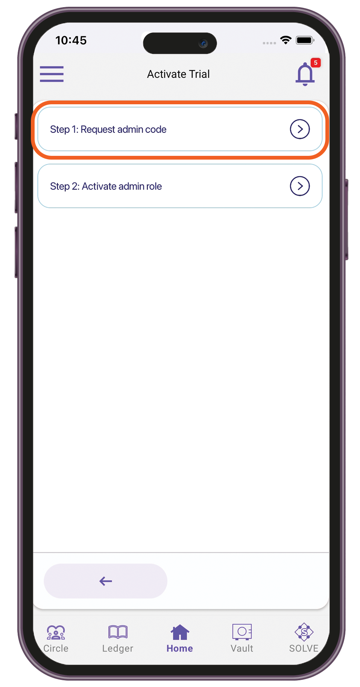
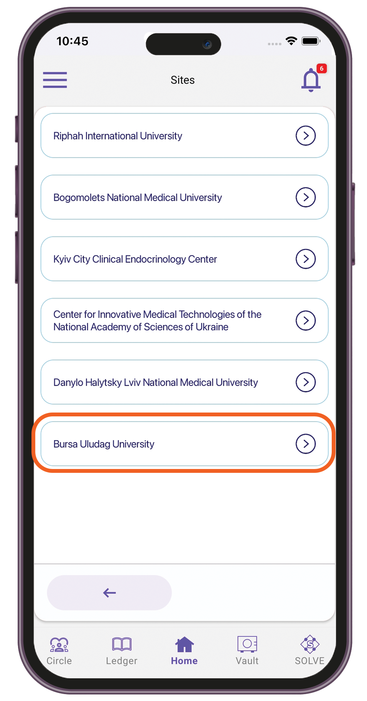

# Trial Admin

### Activating a trial

1. Sign in to the Care.Wallet app.
2. From the Manage Networks screen, tap **Care.Trials**.
3. Tap **Start Here**.

<figure><figcaption></figcaption></figure>

4. Tap **Activate Trial**.
5. Tap **Step 1: Request admin code.**

<figure><figcaption></figcaption></figure>

6. Enter the Trial ID and the email address where you want the activation code to be sent.

<figure><figcaption></figcaption></figure>

7. Tap **Request code**. Wait for the activation code to be sent to your email.
8. Tap **Step 2: Activate admin role**.

<figure><figcaption></figcaption></figure>

9. Enter the activation code you received in Step 1.

<figure><figcaption></figcaption></figure>

10. Tap **Activate**.

### Updating trial info

1. Sign in to the Care.Wallet app.
2. From the Manage Networks screen, tap **Care.Trials**.
3. Tap **Start Here**.

<figure><figcaption></figcaption></figure>

4. In the "Active trials" list, select the trial you want to update.

<figure><figcaption></figcaption></figure>

5. Select **Update trial info**.

<figure><figcaption></figcaption></figure>

6. Fill in the details you want to modify.

<figure><figcaption></figcaption></figure>

7. Tap **Update**.

### Setting the budget

1. Sign in to the Care.Wallet app.
2. From the Manage Networks screen, tap **Care.Trials**.
3. Tap **Manage Sites**.

<figure><figcaption></figcaption></figure>

4. Select the site you want to update.
5. Tap **View budget requests**.

<figure><figcaption></figcaption></figure>

6. Select the site and the budget request you want to view.

<figure><figcaption></figcaption></figure>

 

<figure><figcaption></figcaption></figure>

6. To approve the request, tap **Set Budget**.

<figure><figcaption></figcaption></figure>

7. Enter the amount in SOLVE, then add a comment.

<figure><figcaption></figcaption></figure>

8. Tap **Submit**.

### Checking the site statistics

1. Sign in to the Care.Wallet app.
2. From the Manage Networks screen, tap **Care.Trials**.
3. Tap **Manage Sites**.

<figure><figcaption></figcaption></figure>

4. Select the site you want to update.
5. Tap **Check site statistics > Update**.

<figure><figcaption></figcaption></figure>

 

<figure><figcaption></figcaption></figure>

