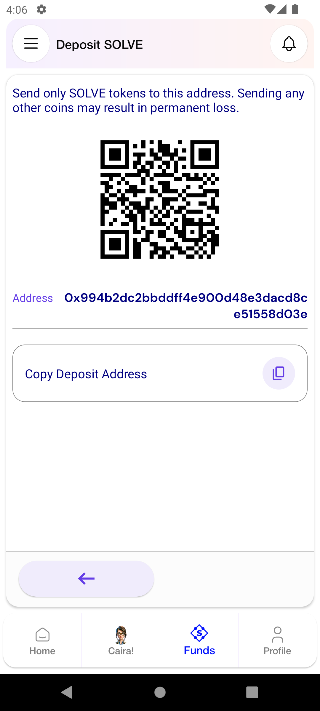

# SOLVE Tokens

## Buying SOLVE

1. Sign in to the TuumIO Wallet app.
2. From the bottom navigation bar, tap **SOLVE**.

<figure><figcaption></figcaption></figure>

3. Select **Buy SOLVE**.

<figure><figcaption></figcaption></figure>

4. Enter the amount in USD.&#x20;
5. The equivalent amount in SOLVE is calculated automatically.
6. Enter your credit card details.
7. Read and accept the terms and conditions.

<figure><figcaption></figcaption></figure>

8. Tap **Buy**.

## Depositing SOLVE

1. Sign in to the TuumIO Wallet app.
2. From the bottom navigation bar, tap **SOLVE**.
3. Select **Deposit SOLVE**.

<figure><figcaption></figcaption></figure>

4. Scan the QR code or copy the deposit address.

<figure><figcaption></figcaption></figure>

## Transferring SOLVE

1. Sign in to the TuumIO Wallet app.
2. From the bottom navigation bar, tap **SOLVE**.
3. Select **Transfer/Gift SOLVE**.

<figure><figcaption></figcaption></figure>

4. Enter the amount in SOLVE.
5. Select recipients from your Care.Circle members or use a Wallet ID.

<figure><figcaption>
Transfer to Care.Circle
</figcaption></figure>

 

<figure><figcaption>
Transfer to Wallet
</figcaption></figure>

6. Tap **Transfer**.
7. Enter your PIN code.

<figure><figcaption></figcaption></figure>

8. Tap **Confirm**.

## Paying bills

1. Sign in to the TuumIO Wallet app.
2. From the bottom navigation bar, tap **SOLVE**.
3. Select **Pay Bills**.

<figure><figcaption></figcaption></figure>

4. Select the bill you want to pay.
5. Send your payment.

## Viewing transactions history

1. Sign in to the TuumIO Wallet app.
2. From the bottom navigation bar, tap **SOLVE**.
3. Select **Transactions History**.

<figure><figcaption></figcaption></figure>

4. Select a transaction to view the details.

<figure><figcaption></figcaption></figure>
