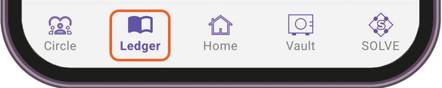
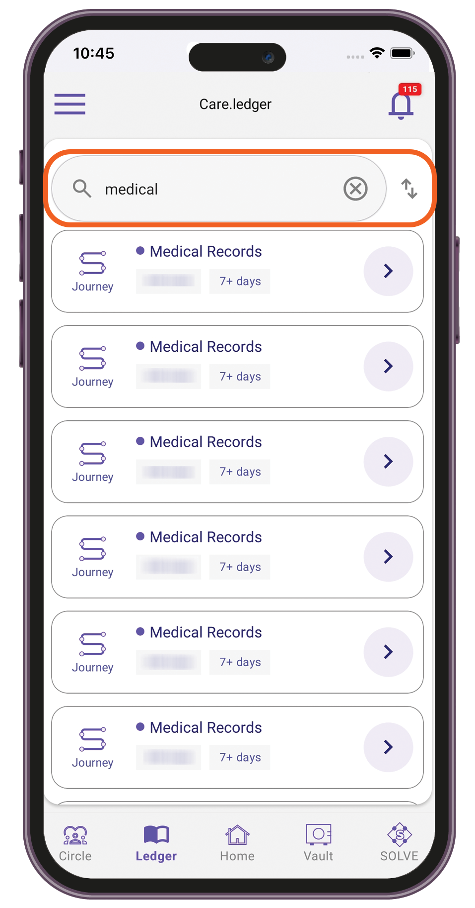
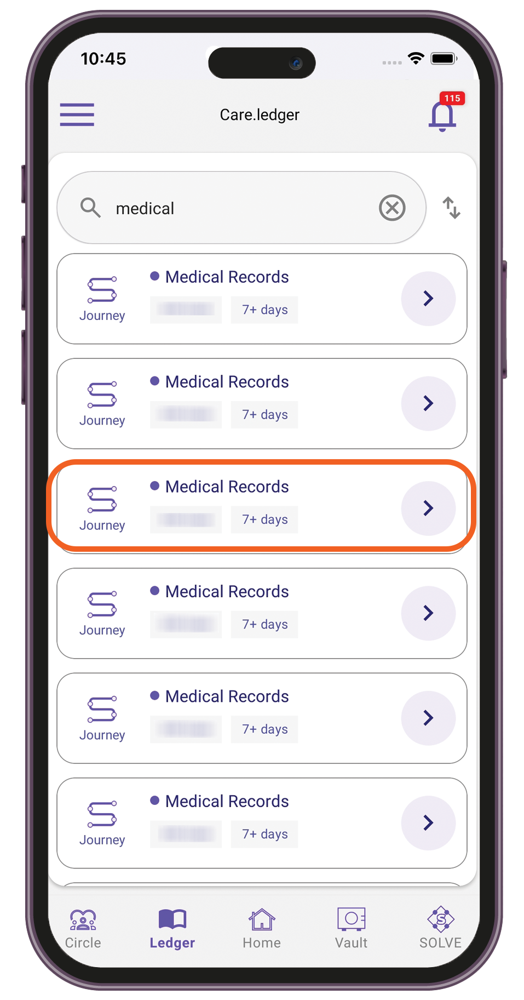
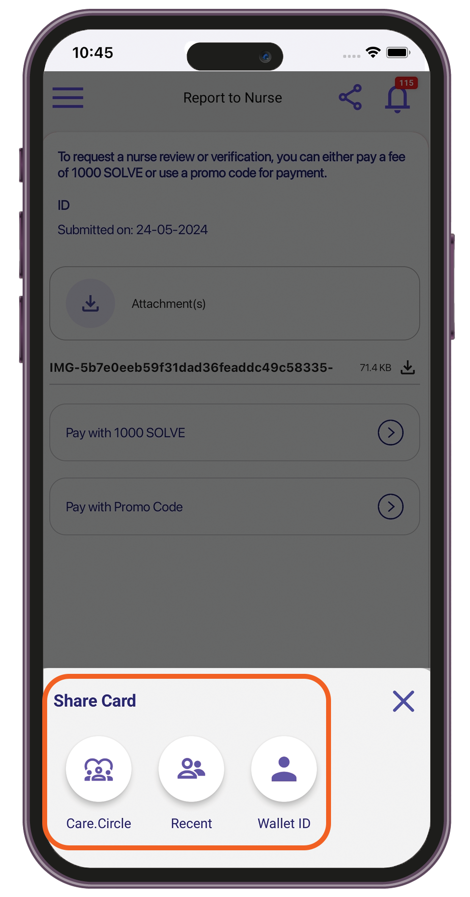

# TuumIO Ledger

## Viewing event records history

1. Sign in to your TuumIO Wallet app.
2. From the bottom navigation bar, tap **Ledger**.

<figure><figcaption></figcaption></figure>

3.  Do any of the following:

    * Use the search bar to filter the records.&#x20;

    <figure><figcaption></figcaption></figure>

    * Select an event record to view its details.

    <figure><figcaption></figcaption></figure>

    * Share an event record with other users.&#x20;

    <figure><figcaption></figcaption></figure>
