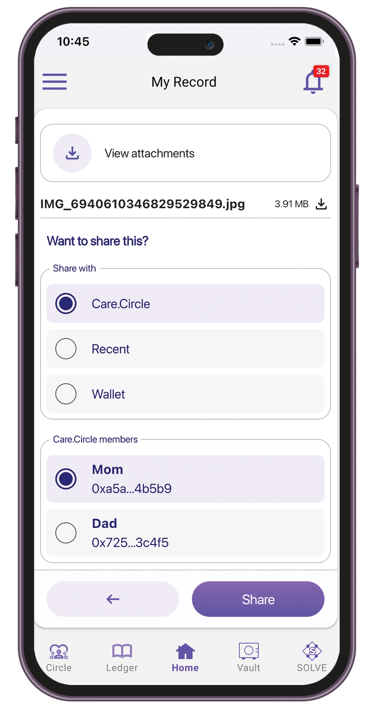

# TuumIO Pilot

## Welcome aboard!

Start your journey to better health, connect with your loved ones, and engage with the community.

## Learn about Care.Wallet

1. Sign in to your TuumIO Wallet app.
2. From the TuumIO Pilot screen, tap **Learn**.

<figure><figcaption></figcaption></figure>

3. Select the topic you want to learn about.

<figure><figcaption></figcaption></figure>

4. Watch the tutorial videos on how to use the features.

## Manage your records

### Adding your ID or medical records

1. Sign in to your TuumIO Wallet app.
2. From the TuumIO Pilot screen, tap **Manage**.

<figure><figcaption></figcaption></figure>

3. Select **My Records**.

<figure><figcaption></figcaption></figure>

4. Tap "**New record**" to add your ID or medical records.

<figure><figcaption></figcaption></figure>

5. Fill in the name, select the record type, then attach the file.

<figure><figcaption></figcaption></figure>

6. Tap **Save**.

### Sharing your records

1. Sign in to your TuumIO Wallet app.
2. From the TuumIO Pilot screen, tap **Manage**.
3. Select **My Records**.
4. Tap the record you want to share.

<figure><figcaption></figcaption></figure>

5. Select a recipient from your TuumIO Circle or recent contacts, or use the recipient's wallet ID.

<figure><figcaption></figcaption></figure>

6. Tap **Share**.

### Viewing shared records

1. Sign in to your TuumIO Wallet app.
2. From the TuumIO Pilot screen, tap **Manage**.
3. Select "**Shared with me**".

<figure><figcaption></figcaption></figure>

4. Tap the record you want to view.

<figure><figcaption></figcaption></figure>

## Ask your loved ones

### Sending health questions

1. Sign in to your TuumIO Wallet app.
2. From the TuumIO Pilot screen, tap **Ask**.

<figure><figcaption></figcaption></figure>

3. Select **Ask your loved ones**.

<figure><figcaption></figcaption></figure>

4. Enter the TuumIO Wallet ID of the recipient, then select a question.

<figure><figcaption></figcaption></figure>

5. Tap **Send**.

### Answering received questions

1. Sign in to your TuumIO Wallet app.
2. From the TuumIO Pilot screen, tap **Ask**.
3. Tap "**My answers**".

<figure><figcaption></figcaption></figure>

4. Select the question you want to answer.

<figure><figcaption></figcaption></figure>

5. Enter your answer.

<figure><figcaption></figcaption></figure>

6. Tap **Send**.

### Viewing sent history

1. Sign in to your TuumIO Wallet app.
2. From the TuumIO Pilot screen, tap **Ask**.
3. Tap "**Sent by me**".

<figure><figcaption></figcaption></figure>

4. Select the sent question or response you want to view.

<figure><figcaption></figcaption></figure>

## Engage with the community

Participate in surveys and get updates from the community.

1. Sign in to your TuumIO Wallet app.
2. From the TuumIO Pilot screen, tap **Engage**.

<figure><figcaption></figcaption></figure>

3. Select a voting poll where you want to participate.

<figure><figcaption></figcaption></figure>
