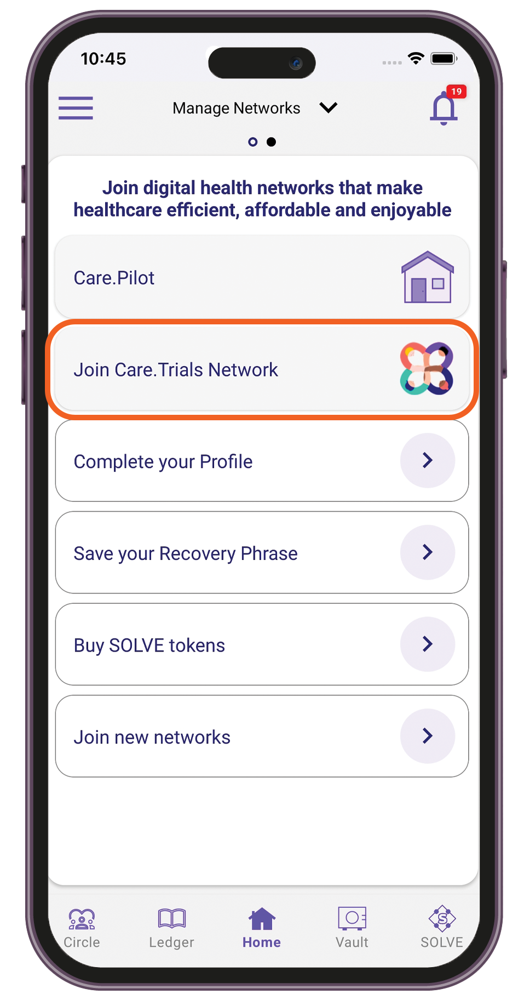
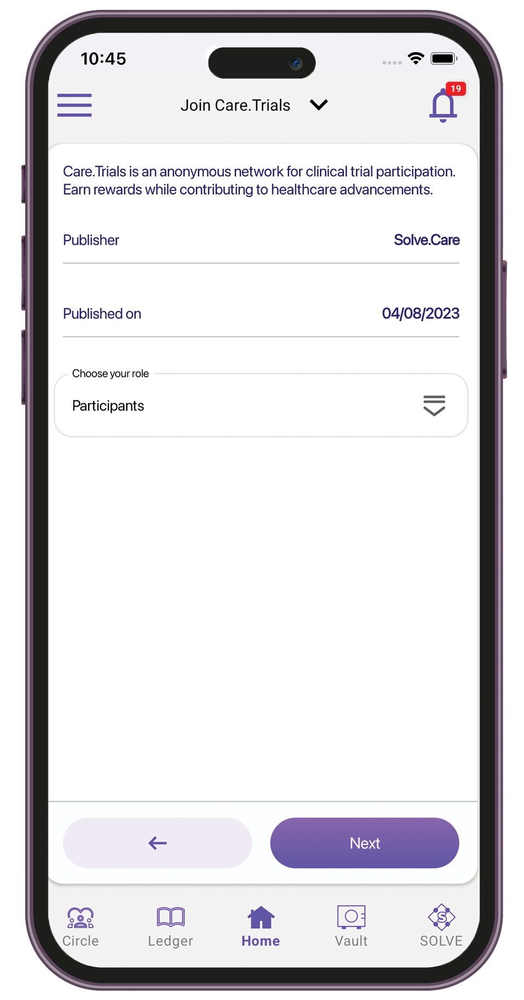
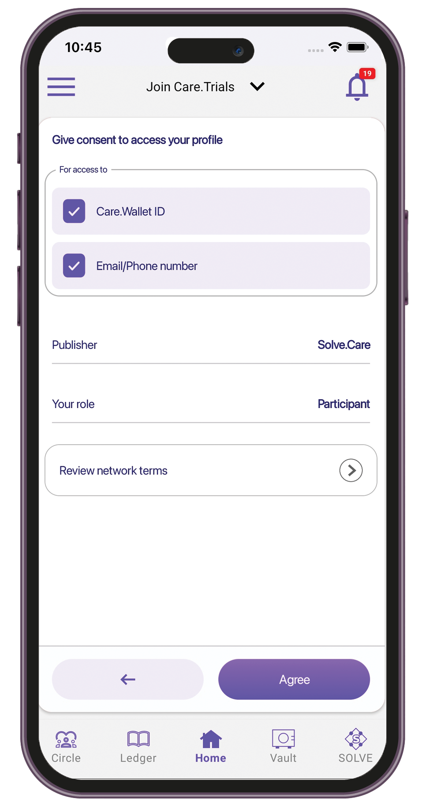

# TuumIO Trials

## Getting started

Participate in clinical trials to help discover new treatments and contribute to medical advancements. Join TuumIO Trials and search for clinical trials near you.&#x20;

## Types of roles in Care.Trials

* **Participants** — When you join TuumIO Trials as a participant, you will have access to available trials that match your profile. Use swiping to like or skip matched trials.
* **Physician** — The physician, also known as principal investigator, helps connect patients to relevant clinical trials. In TuumIO Trials, the physician can browse trials, refer patients and search for trial sponsors.
* **Site Admin** — The site admin helps coordinate clinical trials in a specific site location. In TuumIO Trials, the site admin can view leads and interact with the participants.
* **Trial Admin** — The trial admin oversees the clinical trials in all sites. In TuumIO Trials, the trial admin can activate trials and set the budget for a trial site.
* **Nurse** — The nurse in Care.Trials can review medical records and verify the eligibility of participants.

## Joining the Care.Trials network

1. Sign in to the TuumIO Wallet app.
2. From the Manage Networks screen, tap **Join TuumIO Trials Network**.

<figure><figcaption></figcaption></figure>

3. Select your role, then tap **Next**.&#x20;

<figure><figcaption></figcaption></figure>

4. Grant access to your profile information.&#x20;

<figure><figcaption></figcaption></figure>

5. Review the terms and conditions, then tap **Agree**.
6. Wait up to 5 minutes to connect your TuumIO Wallet to the network.
