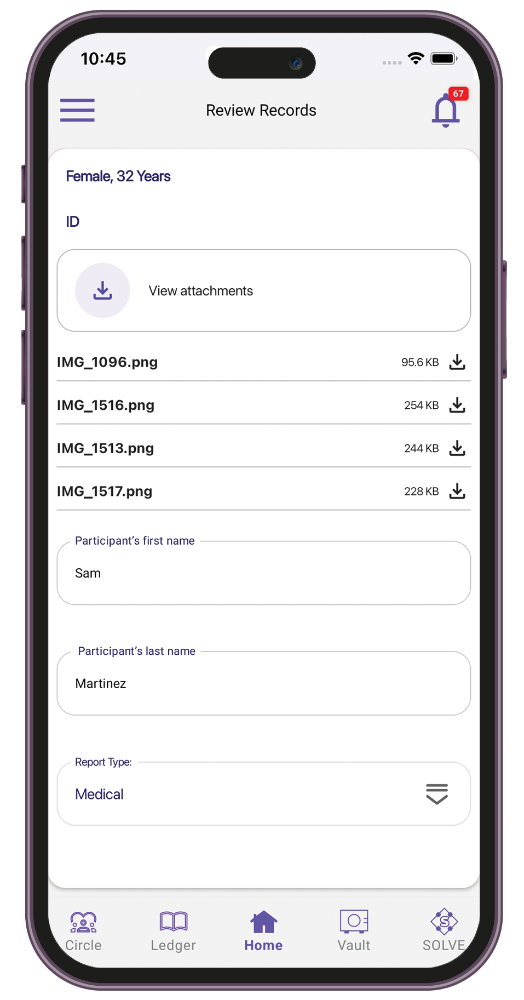
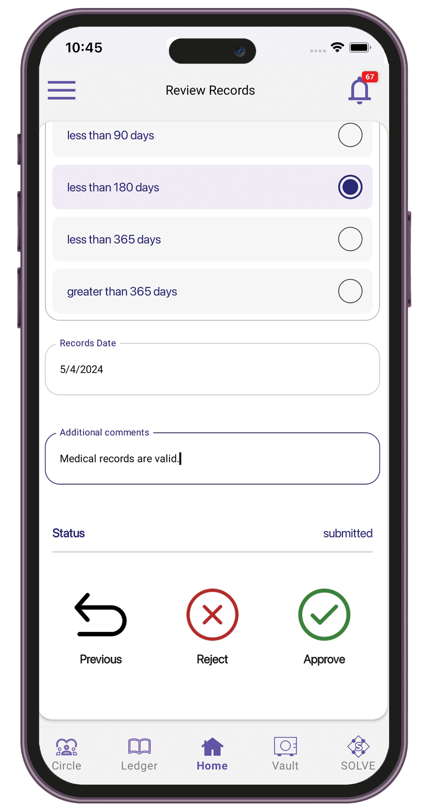

# Nurse

### Reviewing ID and medical records

1. Sign in to the TuumIO Wallet app.
2. From the Manage Networks screen, tap **TuumIO Trials**.
3. Tap **Manage the Records > Pending record review**.

<figure><figcaption></figcaption></figure>

 

<figure><figcaption></figcaption></figure>

4. Review the attached records, then fill in the participant details.

<figure><figcaption></figcaption></figure>

 

<figure><figcaption></figcaption></figure>

5. Approve or reject the records.

### Viewing history of reviewed records

1. Sign in to the TuumIO Wallet app.
2. From the Manage Networks screen, tap **TuumIO Trials**.
3. Tap **Record** **> Reviewed records**.

<figure><figcaption></figcaption></figure>

4. Select the record details you want to view.

<figure><figcaption></figcaption></figure>

 

<figure><figcaption></figcaption></figure>

### Reviewing lead eligibility

1. Sign in to the TuumIO Wallet app.
2. From the Manage Networks screen, tap **TuumIO Trials**.
3. Tap **Review Trials Liked by Leads > Pending Review**.

<figure><figcaption></figcaption></figure>

 

<figure><figcaption></figcaption></figure>

4. Select the lead you want to review.
5. Do either of the following:
   * View the details of the trial
   * Ask a question to the lead

<figure><figcaption></figcaption></figure>

6. Approve or reject the lead.

### Viewing lead verification details

1. Sign in to the TuumIO Wallet app.
2. From the Manage Networks screen, tap **TuumIO Trials**.
3. Tap **Review Trials Liked by Leads > Reviewed Leads**.

<figure><figcaption></figcaption></figure>

4. Select the lead verification details that you want to view.

<figure><figcaption></figcaption></figure>

 

<figure><figcaption></figcaption></figure>

