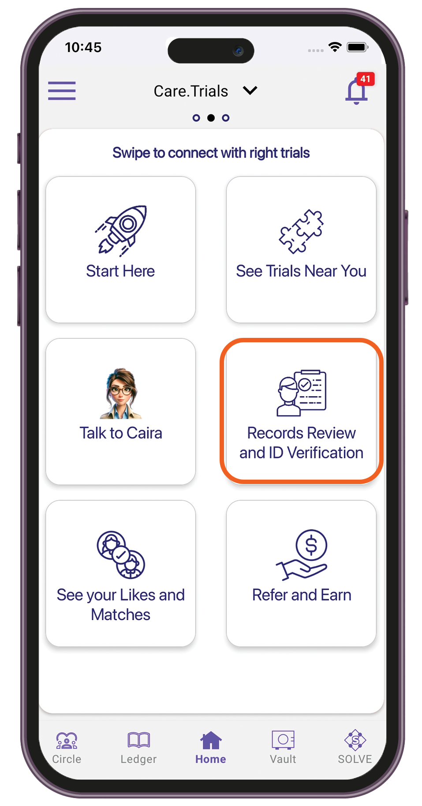
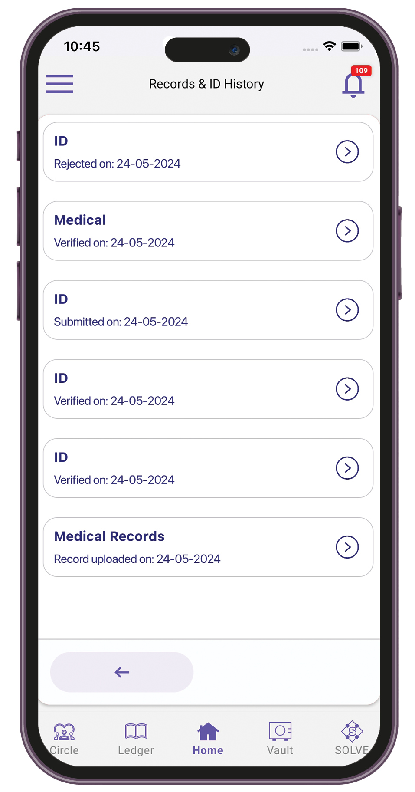
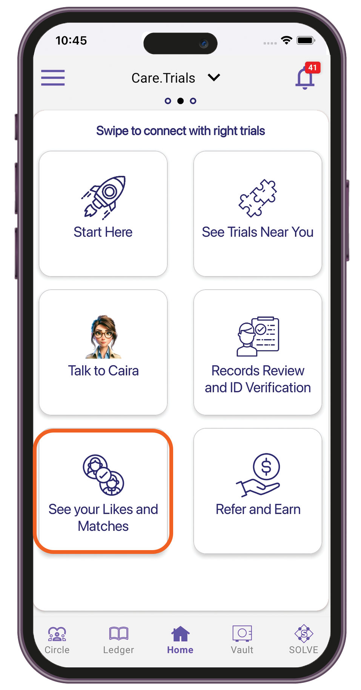

# Participant

### Getting matched for clinical trials

1. Sign in to the TuumIO Wallet app.
2. From the Manage Networks screen, tap **TuumIO Trials**.
3. Tap **Start Here**.

<figure><figcaption></figcaption></figure>

4. To get an overview of the next steps, watch the video. To read the FAQs, tap **Learn more**.

<figure><figcaption></figcaption></figure>

5. Tap **Start** to proceed**.**
6. Answer the 5 questions to create your profile for matching clinical trials.

<figure><figcaption></figcaption></figure>

7. Agree to the terms and conditions and privacy policy.

<figure><figcaption></figcaption></figure>

8. Tap **Submit**.
9. Wait up to 5 minutes to search for available trials near you.

### Swiping matched trials

1. Sign in to the TuumIO Wallet app.
2. From the Manage Networks screen, tap **TuumIO Trials**.
3. Tap **See Trials Near You**.

<figure><figcaption></figcaption></figure>

4. Swipe left or right to browse through available trials.&#x20;

<figure><figcaption></figcaption></figure>

5. Like the trial you want to participate in. You can also skip or go back to the previous trial.

### Uploading your medical records and ID

1. Sign in to the TuumIO Wallet app.
2. From the Manage Networks screen, tap **TuumIO Trials**.
3. Tap **Records Review and ID Verification**.

<figure><figcaption></figcaption></figure>

4. Select **Upload records and ID**.

<figure><figcaption></figcaption></figure>

5. Select the type of attachment you want to upload.

<figure><figcaption></figcaption></figure>

6. Select a file from your device or take a photo.
7. Tap **Upload**.

### Submitting records for review or verification

1. Sign in to the TuumIO Wallet app.
2. From the Manage Networks screen, tap **TuumIO Trials**.
3. Tap **Records Review and ID Verification**.
4. Select **Records Review and ID Verification**.&#x20;

<figure><figcaption></figcaption></figure>

5. Select the record or ID you want to submit.

<figure><figcaption></figcaption></figure>

6. Attach the file, then select your payment option.

<figure><figcaption></figcaption></figure>

7. Confirm your payment.

### Viewing records history

1. Sign in to the TuumIO Wallet app.
2. From the Manage Networks screen, tap **TuumIO Trials**.
3. Tap **Records Review and ID Verification**.
4. Select **Records & ID History**.

<figure><figcaption></figcaption></figure>

5. Select the record or ID that you want to view.&#x20;

<figure><figcaption></figcaption></figure>

### Managing liked trials

1. Sign in to the TuumIO Wallet app.
2. From the Manage Networks screen, tap **TuumIO Trials**.
3. Tap **See your Likes and Matches**.

<figure><figcaption></figcaption></figure>

4. In the "**Trials you liked**" screen, select any of the following:
   * **Matched** — View the clinical trials you liked that the site admin has responded to.
   * **No response** — View the clinical trials you liked that the site admin has not yet responded to.
   * **Not a fit** — View trials you liked but don't match your profile.

<figure><figcaption></figcaption></figure>
