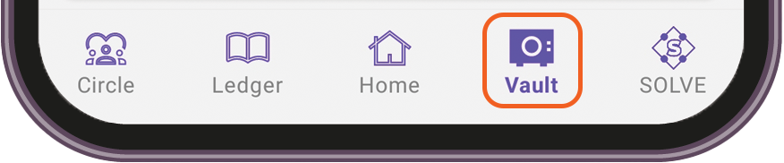

# TuumIO Vault

## Viewing user event records

1. Sign in to your TuumIO Wallet app.
2. From the bottom navigation bar, tap **Vault**.

<figure><figcaption></figcaption></figure>

3.  Do either of the following:

    * Use the search bar to filter the list.&#x20;

    <figure><figcaption></figcaption></figure>

    * View the details of event records for each user.

    <figure><figcaption></figcaption></figure>
