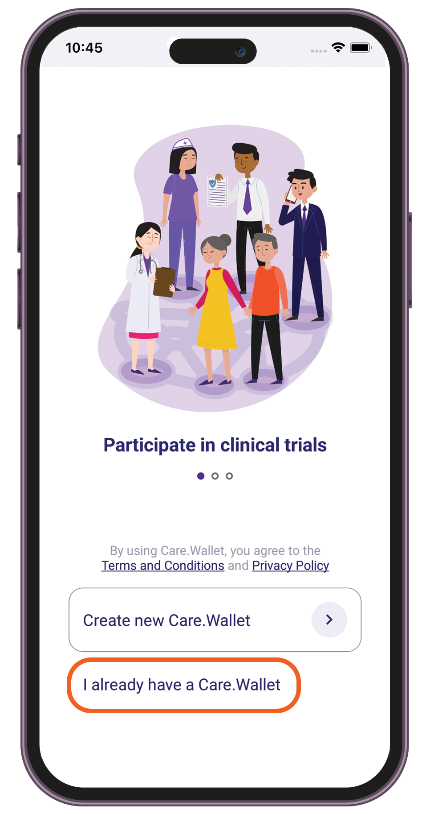

# User Access

### Signing up to Care.Wallet

1. Open the Care.Wallet app from your mobile device.
2. Tap **Create new Care.Wallet**.

<figure><figcaption></figcaption></figure>

3. Select a registration method, and then enter your details.

<figure><figcaption>
Email
</figcaption></figure>

 

<figure><figcaption>
WhatsApp
</figcaption></figure>

 

<figure><figcaption>
SMS
</figcaption></figure>

4. Enter the one-time code sent to you, then tap **Next**.

<figure><figcaption></figcaption></figure>

5. Set up a 6-digit passcode, then tap **Next**.

<figure><figcaption></figcaption></figure>

6. If you want to use biometrics to sign in, tap **Allow**.

<figure><figcaption></figcaption></figure>

7. Scan your fingerprint or use Face ID.
8. Wait a few seconds to create your account.


Save your recovery phrase and keep it in a safe place. For complete instructions, see [Saving your recovery phrase](user-access.md#saving-your-recovery-phrase).


### Signing in to Care.Wallet

1. Open the Care.Wallet app from your mobile device.
2. Tap **I already have a Care.Wallet**.

<figure><figcaption></figcaption></figure>

3. Enter your 6-digit passcode, then tap **Next**.

<figure><figcaption></figcaption></figure>

4. If biometrics is enabled, scan your fingerprint or use Face ID.
5. Wait a few seconds for the home screen to load.

### Resetting your passcode

1. Open the Care.Wallet app from your mobile device.
2. In the "Enter your Passcode" screen, tap "**Forgot your Passcode?**".

<figure><figcaption></figcaption></figure>

3. Select the method you used during sign-up.&#x20;

<figure><figcaption></figcaption></figure>

4. Enter the one-time code sent to you, then tap **Next**.
5. Set up a new passcode.

<figure><figcaption></figcaption></figure>

### Saving your recovery phrase

1. Open the Care.Wallet app from your mobile device.
2. From the Manage Networks screen, tap **Save your Recovery Phrase**.

<figure><figcaption></figcaption></figure>

3. Allow access to view the Recovery Phrase.

<figure><figcaption></figcaption></figure>

4. Enter your passcode, then tap **Next**.
5. Copy the phrase or write it down.

<figure><figcaption></figcaption></figure>

