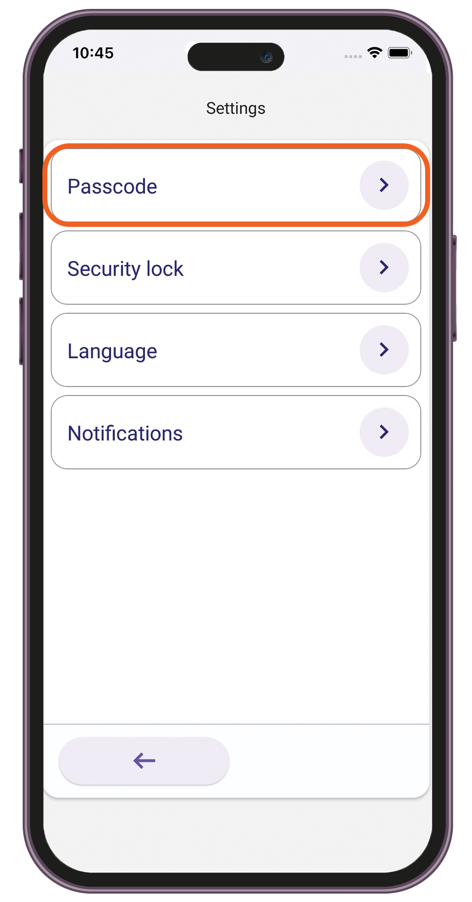

# User Access

### Signing up to Care.Wallet

1. Open the Care.Wallet app from your mobile device.
2. Tap **Create new Care.Wallet**.

<figure><figcaption></figcaption></figure>

3. Allow the app to access your device's location.

<figure><figcaption></figcaption></figure>

4. Choose a method for signing up. Do one of the following:
   *   Select **Continue with Facebook**.&#x20;

       

       <figure><figcaption></figcaption></figure>

       

   *   Enter your email address.&#x20;

       

       <figure><figcaption></figcaption></figure>

       

   *   Enter your Viber phone number.&#x20;

       

       <figure><figcaption></figcaption></figure>

       

   *   Enter your WhatsApp phone number.&#x20;

       

       <figure><figcaption></figcaption></figure>

       

5. If necessary, enter the one-time code sent to you, then tap **Next**.
6. Set up a 6-digit passcode, then tap **Next**.

<figure><figcaption></figcaption></figure>

7. Allow the app to use biometrics for added security when accessing your account.
8. Use fingerprint scan or facial recognition.
9. Wait a few seconds for your account to be created.


Save your recovery phrase and keep it in a safe place. For complete instructions, see [Saving your recovery phrase](user-access.md#saving-your-recovery-phrase).


### Signing in to Care.Wallet

1. Open the Care.Wallet app from your mobile device.
2. Tap **I already have a Care.Wallet**.

<figure><figcaption></figcaption></figure>

3. Enter your 6-digit passcode, then tap **Next**.

<figure><figcaption></figcaption></figure>

4. If biometrics is enabled, use fingerprint scan or facial recognition.
5. Wait a few seconds for the home screen to load.

### Resetting your passcode

1. Sign in to your Care.Wallet app.
2.  Do either of the following:

    * In the "Enter your Passcode" screen, tap "**Forgot your passcode?**".

    

    <figure><figcaption></figcaption></figure>

    

    * Tap the menu icon, then go to **Settings > Passcode**.

    

    <figure><figcaption></figcaption></figure>

    

3. Select the method you used during sign-up.&#x20;

<figure><figcaption></figcaption></figure>

4. Enter the one-time code sent to you, then tap **Next**.
5. Set up a new passcode.

<figure><figcaption></figcaption></figure>

### Saving your recovery phrase

1. Sign in to your Care.Wallet app.
2. From the Manage Networks screen, tap **Save your Recovery Phrase**.

<figure><figcaption></figcaption></figure>

3. Allow access to view the recovery phrase.

<figure><figcaption></figcaption></figure>

4. Enter your passcode, then tap **Next**.
5. Copy the phrase or write it down.

<figure><figcaption></figcaption></figure>


If you lose your mobile device or uninstall the app, you can use the recovery phrase to restore your access to Care.Wallet.


### Recovering your access

1. Open the Care.Wallet app from your mobile device.
2. Tap **I already have a Care.Wallet**.
3. Enter your recovery phrase.

<figure><figcaption></figcaption></figure>

4. Accept the terms and conditions, then tap **Next**.
5. Enter your passcode, then tap **Next**.
6. Allow the app to use biometrics for added security when accessing your account.
7. Use fingerprint scan or facial recognition.
8. Wait a few seconds for the home screen to load.

