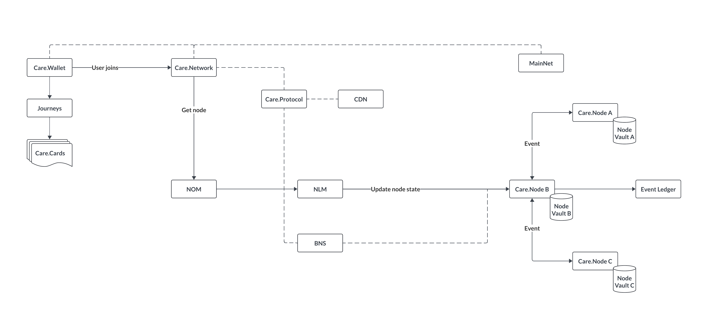

# Architecture

<figure><figcaption>
Figure 4: High-level Platform Architecture
</figcaption></figure>

## Application Layer

The **Application Layer** handles the configuration, administration, and communication within networks, and allows users to interact with decentralized applications.

* **Care.Wallet**: A mobile app that allows users to store and manage digital assets and serves as a gateway to decentralized applications (dApps).
* **dApps (Journeys)**: A sequence of interconnected cards outlining specific workflows for roles such as participants, admin, managers and employees.
* **Care.Cards**: Information units containing text, images, and interactive buttons on the app's user interface.
* **Care.Network**: A digital network of various healthcare roles, operating based on rules defined in a Care.Protocol.
* **Care.Protocol**: Governs rules and event definitions, facilitating secure transactions and interactions within the network.

## Data Layer

The **Data Layer** provides secure, transparent, and decentralized data storage and management.

* **MainNet**: Holds the core registry service that maps Care.Wallet users to their respective Care.Networks, such as the country matrix for region-based services.
* **Node Vault**: A secure, decentralized storage of data for Care.Nodes, with backups stored in [Storj](https://www.storj.io/).
* **Event Ledger**: A decentralized record of event logs from sender and recipient node addresses, including payload data.
* **Care Data Node (CDN)**: A specialized node created for each network. It manages data storage, processing, and exchanges with external systems for each network.

## Compute Layer

The **Compute Layer** manages core operations and node management, ensuring secure data and event transmission across the network.

* **Care.Node**: An entity that manages data storage and event handling across the network. It is a secure, versatile object deployable in any environment.
* **Network Onboarding Manager (NOM)**: Facilitates the initial creation and assignments of Care.Nodes upon joining the network.
* **Node Lifecycle Manager (NLM)**: Manages the creation and lifecycle states of Care.Nodes, including active, start, stop, and hibernate states.
* **Base Node Services (BNS)**: Ensures secure transmission of events and data through the blockchain.

