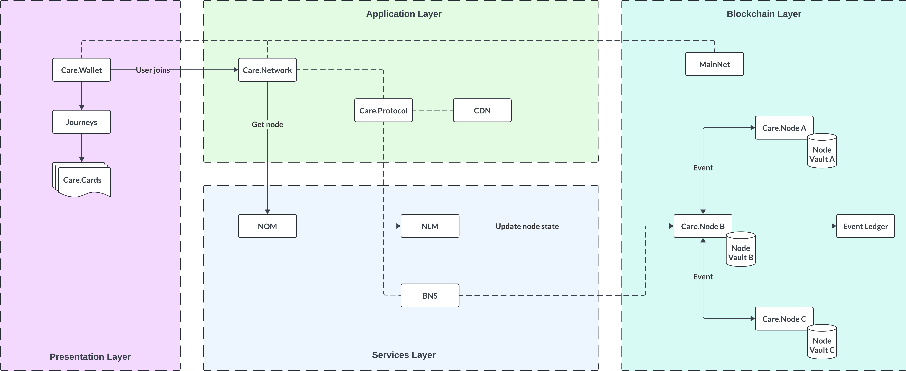

# Architecture

<figure><figcaption>
Figure 4:  Care.Platform Architecture Layers
</figcaption></figure>

## Presentation Layer

The **Presentation Layer** allows users to securely interact with cards, journeys, networks, and personal data.

* **Care.Wallet**: A mobile app that acts as a gateway for users to join a Care.Network and access personalized healthcare services.
* **Journeys**: A sequence of interconnected cards within a Care.Network, outlining specific workflows for roles like patients, doctors, and nurses.
* **Care.Cards**: Information units containing text, images, and interactive buttons on the app's user interface.

## Application Layer

The **Application Layer** handles configuration, administration, and communication within networks, including integration with external sources.

* **Care.Network**: A digital network of various healthcare roles, operating based on rules defined in a Care.Protocol.
* **Care.Protocol**: Governs rules and event definitions, facilitating secure transactions and interactions within the network.
* **Care Data Node (CDN)**: A specialized node created for each network. It manages data storage, processing, and exchanges with external systems for each network.

## Services Layer

The **Services Layer** manages core operations and node management, ensuring secure data and event transmission across the network.

* **Network Onboarding Manager (NOM)**: Facilitates the initial creation and assignments of Care.Nodes upon joining the network.
* **Node Lifecycle Manager (NLM)**: Manages the creation and lifecycle states of Care.Nodes, including active, start, stop, and hibernate states.
* **Base Node Services (BNS)**: Ensures secure transmission of events and data through the blockchain.

## Blockchain Layer

The **Blockchain Layer** provides secure, transparent, and decentralized data storage and transaction recording.

* **Care.Node**: Manages data storage and event handling across the network. It is a secure, versatile object deployable in any environment.
* **MainNet**: Holds the core registry service that maps Care.Wallet users to their respective Care.Networks, such as the country matrix for region-based services.
* **Node Vault**: Ensures secure storage and management of personal data for Care.Nodes, with data backups stored in [Storj](https://www.storj.io/).
* **Event Ledger**: Records event logs, including payload data, from sender node addresses to recipient node addresses.
