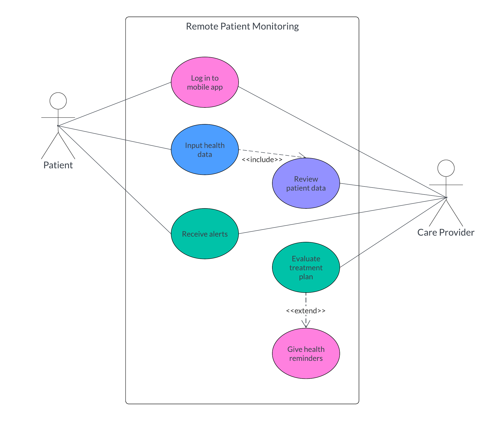
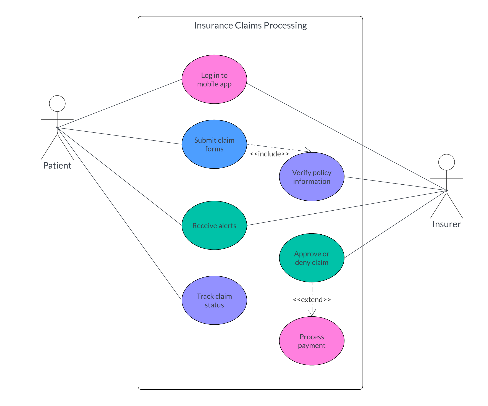
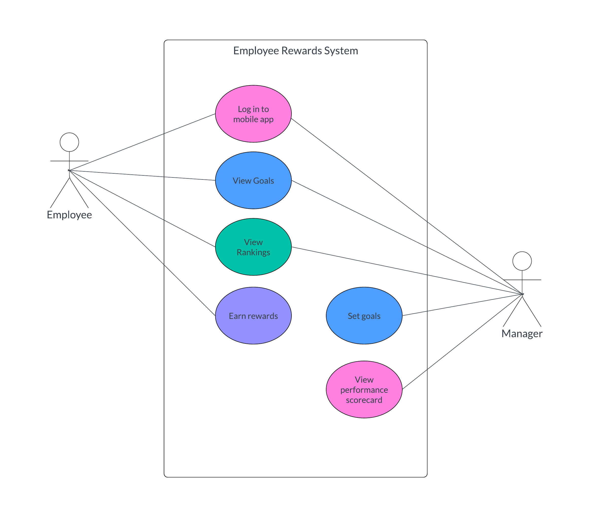

# Getting Started

### What is Care.Platform?

Care.Platform is an ecosystem of healthcare solutions, built on blockchain, that aims to bridge the gaps in clinical care operations at a global scale. It reduces cost in IT infrastructure while ensuring data security and regulatory compliance in healthcare.

With Care.Platform, you can build care networks to streamline the process and delivery of healthcare services. Here are some examples of use cases in care networks:

#### Remote patient monitoring&#x20;

In remote patient monitoring systems, the care provider does not directly administer treatment. The system facilitates treatment adjustments and provide support for the patient to manage their condition.

<figure><figcaption>
Figure 1.0: Use case diagram for remote patient monitoring
</figcaption></figure>

#### Insurance claims processing

In most cases, the healthcare provider handles submitting the insurance claim on behalf of the patient. For reimbursement plans, such as vision or dental insurance, the patient may be required to pay upfront and then submit a claim to get reimbursed.

<figure><figcaption>
Figure 1.1: Use case diagram for insurance claims processing
</figcaption></figure>

#### Employee rewards system

Healthcare employees spend long hours of work shifts and face stressful situations on a daily basis. To avoid burnout and high turnover, it is crucial in health organizations to implement recognition and rewards system for their employees. It can be in a form of gift cards, paid time offs, discount vouchers, wellness programs, and more.

<figure><figcaption>
Figure 1.2: Use case diagram for employee rewards system
</figcaption></figure>

