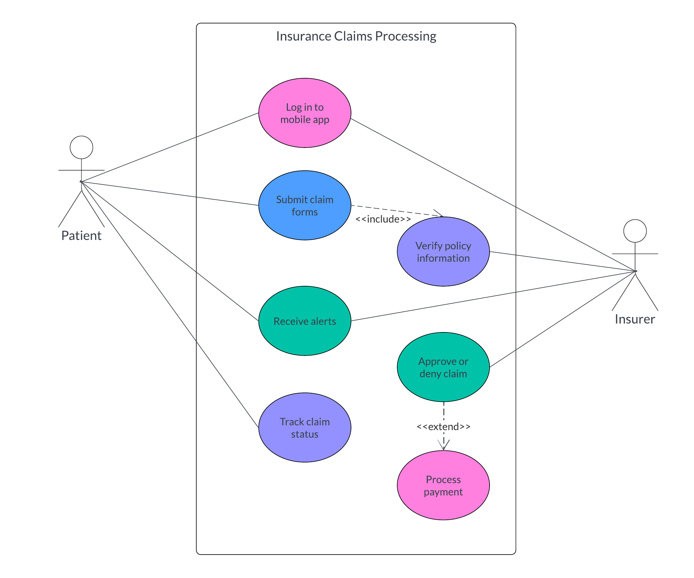

# Introduction

## What is Care.Platform?

**Care.Platform** is a secure and decentralized platform that empowers individuals to take control of their data using blockchain-powered technologies. It is designed to reduce reliance on centralized IT systems and provides a foundation for Web3 development.

## **Key Components**

**Chains**: Enterprise-level solutions that offer a wide range of products and services categorized by various industries, such as healthcare, finance, gaming, and more.

**dApp**: A decentralized application in Web3 that offers various functionalities, including interactions, data exchanges, and workflows for specific user roles.

**Care.Wallet**: A mobile application that allows users to store and manage digital assets, and serves as a gateway to chains and decentralized applications (dApps).

## Use Case Examples

### Remote patient monitoring

Facilitates treatment adjustments and supports patients in managing their conditions remotely, without direct intervention from care providers.

<figure><figcaption>
Figure 1: Use case diagram for remote patient monitoring
</figcaption></figure>

### Insurance claims processing

Manages the submission and processing of insurance claims. Patients can submit claims for reimbursement plans, such as vision or dental insurance, ensuring faster and more transparent processing.

<figure><figcaption>
Figure 2: Use case diagram for insurance claims processing
</figcaption></figure>

### Employee rewards system

Addresses burnout and high turnover among employees by implementing a rewards system. This can include gift cards, paid time offs, discount vouchers, wellness programs, and more.

<figure><figcaption>
Figure 3: Use case diagram for an employee rewards system
</figcaption></figure>

