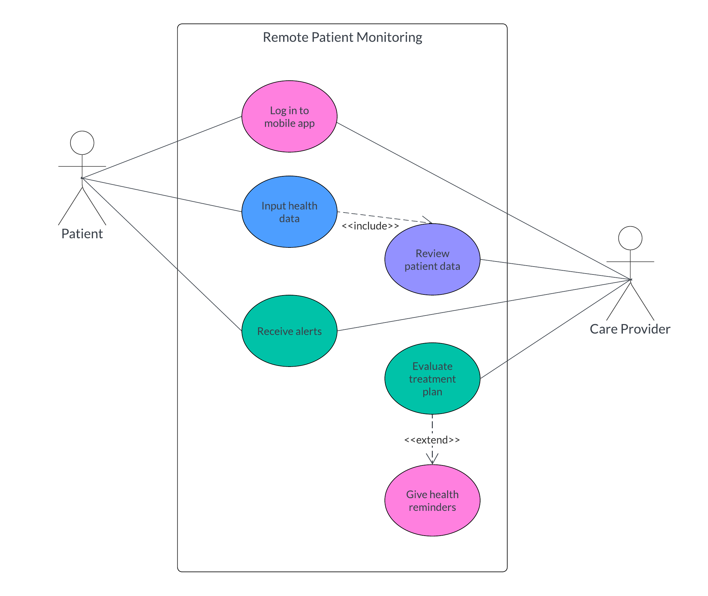

# Introduction

### What is Care.Platform?

**Care.Platform** is an ecosystem of healthcare solutions, built on blockchain, that aims to bridge the gaps in clinical care operations at a global scale. It reduces costs in IT infrastructure while ensuring data security and regulatory compliance in healthcare.

With Care.Platform, you can build care networks to streamline the process and delivery of healthcare services. A care network connects various roles in healthcare using decentralized applications, also known as **Care.Cards**, which can be accessed using **Care.Wallet**.

**Care.Wallet** is a personal healthcare assistant that helps manage your healthcare needs from your mobile device. It contains **Care.Cards** that represent a set of interactions in a healthcare journey, such as handling health records, booking appointments, and processing claims or payments.

### Use Case Examples

#### Remote patient monitoring

In remote patient monitoring systems, the care provider does not directly administer treatment. The system facilitates treatment adjustments and provides support for the patient to manage their condition.

<figure><figcaption>
Figure 1.0: Use case diagram for remote patient monitoring
</figcaption></figure>

#### Insurance claims processing

In most cases, the healthcare provider handles submitting the insurance claim on behalf of the patient. For reimbursement plans, such as vision or dental insurance, the patient may be required to pay upfront and then submit a claim to get reimbursed.

<figure><figcaption>
Figure 1.1: Use case diagram for insurance claims processing
</figcaption></figure>

#### Employee rewards system

Healthcare employees spend long hours of work shifts and often face stressful situations. To avoid burnout and high turnover, health organizations can implement a rewards system for their employees. It can be in the form of gift cards, paid time offs, discount vouchers, wellness programs, and more.

<figure><figcaption>
Figure 1.2: Use case diagram for an employee rewards system
</figcaption></figure>

