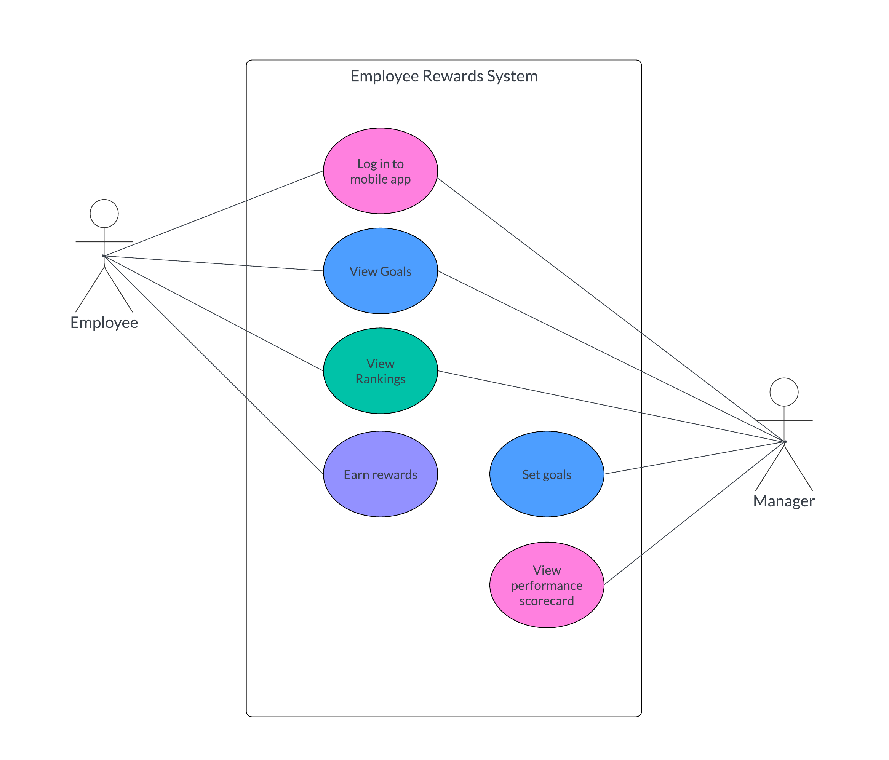

# Introduction

## What is Care.Platform?

Care.Platform is a secure and decentralized ecosystem that allows individuals to take control of their data using blockchain-powered technologies. It is designed to reduce reliance on centralized IT systems and provides a foundation for Web3 development.

## **Key Components**

**Chain**: A distributed ledger that chronologically records a series of events and transactions. These records are linked together, forming a continuous and immutable chain of data.

**Wallet**: A mobile application that allows users to store and manage digital assets and records, and interact with other Wallet users and decentralized applications (dApps).

**dApp**: A decentralized application in Web3 that offers functionalities like interactions, data exchanges, and workflows for specific user roles.

## Use Case Examples

### Remote patient monitoring

Facilitates treatment adjustments and supports patients in managing their conditions remotely, without direct intervention from care providers.

<figure><figcaption>
Figure 1: Use case diagram for remote patient monitoring
</figcaption></figure>

### Insurance claims processing

Manages the submission and processing of insurance claims. Patients can submit claims for reimbursement plans like vision or dental insurance, ensuring faster and more transparent processing.

<figure><figcaption>
Figure 2: Use case diagram for insurance claims processing
</figcaption></figure>

### Employee rewards system

Addresses burnout and high turnover among employees by implementing a rewards system. This can include gift cards, paid time offs, discount vouchers, wellness programs, and more.

<figure><figcaption>
Figure 3: Use case diagram for an employee rewards system
</figcaption></figure>

