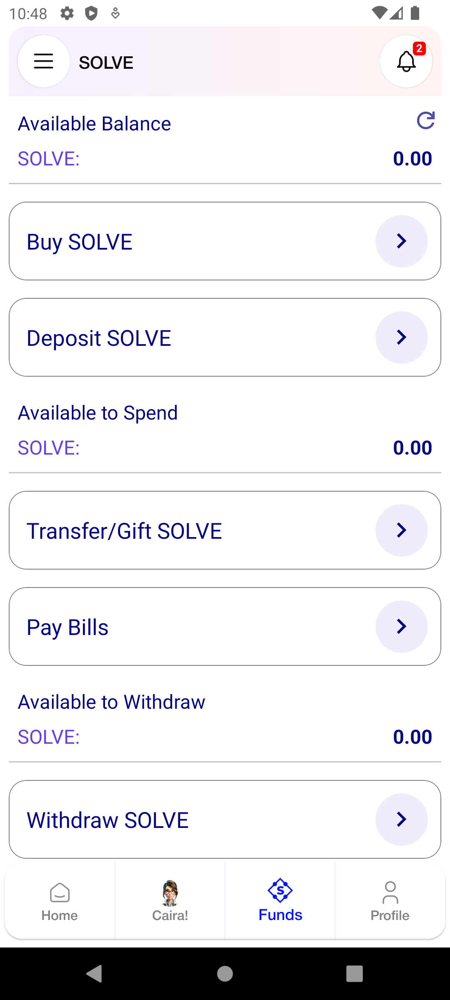
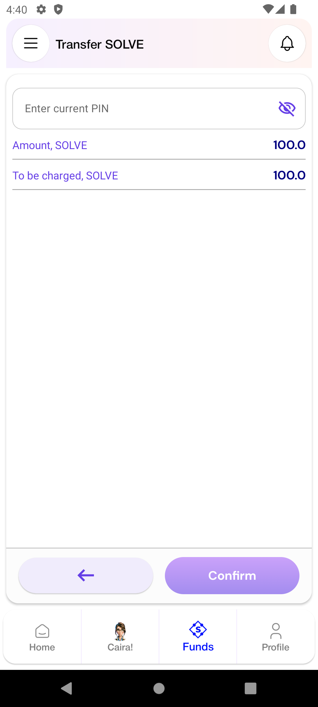
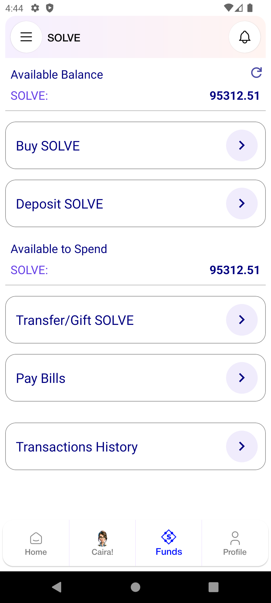

# SOLVE Tokens

## Buying SOLVE

1. Sign in to the TuumIO Wallet app.
2. From the bottom navigation bar, tap **FUNDS**.\
   .png>)
3. Select **Buy SOLVE**.\
    (1).png>)
4. Enter the amount in USD.
5. The equivalent amount in SOLVE is calculated automatically.
6. Select the payment method and enter details.\
   .png>)
7. Tap **Buy**.

## Depositing SOLVE

1. Sign in to the TuumIO Wallet app.
2. From the bottom navigation bar, tap **FUNDS**.
3. Select **Deposit SOLVE**.\
   .png>)
4. Scan the QR code or copy the deposit address.\
   

## Transferring SOLVE

1. Sign in to the TuumIO Wallet app.
2. From the bottom navigation bar, tap **FUNDS**.
3. Select **Transfer/Gift SOLVE**.\
   
4. Enter the amount in SOLVE.
5. Enter the Wallet ID or Scan the QR code of receiver.\
   .png>)
6. Tap **Transfer**.
7. Enter your PIN code.\
   
8. Tap **Confirm**.

## Paying bills

1. Sign in to the TuumIO Wallet app.
2. From the bottom navigation bar, tap **FUNDS**.
3. Select **Pay Bills**.\
   
4. Select the bill you want to pay.
5. Send your payment.

## Viewing transactions history

1. Sign in to the TuumIO Wallet app.
2. From the bottom navigation bar, tap **FUNDS**.
3. Select **Transactions History**.\
   
4. Select a transaction to view the details.\
   
