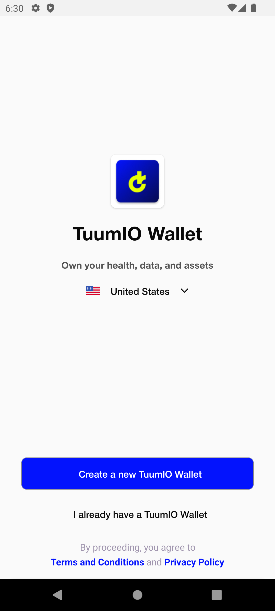

# User Access

### Signing up to TuumIO Wallet

1. Open the TuumIO Wallet app from your mobile device.
2. Tap **Create a new TuumIO Wallet**.\
   
3. Allow the app to access your device's location.\
   .png>)
4. Choose a method for signing up. Do one of the following:\
   
   * Choose 'Receive a code via email' to sign up via your email address.\
     
   * Choose 'Receive a code on your phone' to sign up via your phone number.\
     
   * Choose 'Continue with Facebook' to sign up using your Facebook account.
5. If necessary, enter the one-time code sent to you, and then proceed.\
   
6. Set up a 6-digit Wallet PIN, and then proceed.\
   
7. Allow the app to use biometrics for added security when accessing your account.
8. Use fingerprint scan or facial recognition.
9. Wait a few seconds for your account to be created.


Save your recovery phrase and keep it in a safe place. For complete instructions, see Saving your recovery phrase.


### Signing up to TuumIO Wallet using Apple ID on iOS device

1. Open the TuumIO Wallet app from your mobile device.
2. Tap **Create a new TuumIO Wallet**.
3. Allow the app to access your device's location.
4. Choose **'Continue with Apple'** method for signing up.\
   .png>)
5. Authorise the app to create account using your Apple ID.
6. Set up a 6-digit Wallet PIN, and then proceed.
7. Wait a few seconds for your account to be created.

### Signing in to TuumIO Wallet

1. Open the TuumIO Wallet app from your mobile device.
2. Tap '**I already have a TuumIO Wallet'**.\
   .png>)
3. Enter your 6-digit PIN, and then proceed.\
   
4. If biometrics is enabled, use fingerprint scan or facial recognition.
5. Wait a few seconds for the home screen to load.

### Resetting your passcode

1. Open your TuumIO Wallet app.
2. From the "Login using PIN" screen, tap "**Forgot PIN?**".\
   \
   .png>)\\
3. Enter the one-time code sent to you, and then proceed.\
   
4. Set up a new Wallet PIN for your account.\
   .png>)

### Saving your recovery phrase

1. Sign in to your TuumIO Wallet app.
2. From the Side Menu screen, tap **Backup**.\
   
3. Allow access to view the recovery phrase.\
   
4. Enter your Wallet PIN, then tap **Next**.
5. Copy the phrase or write it down.\
   


If you lose your mobile device or uninstall the app, you can use the recovery phrase to restore your access to TuumIO Wallet.


### Recovering the access

1. Open the TuumIO Wallet app from your mobile device.
2. Tap '**I already have a TuumIO Wallet'**.
3. Enter your recovery phrase.\
   
4. Enter your Wallet PIN, and then proceed.\
   
5. Allow the app to use biometrics for added security when accessing your account.
6. Use fingerprint scan or facial recognition.
7. Wait a few seconds for the home screen to load.
